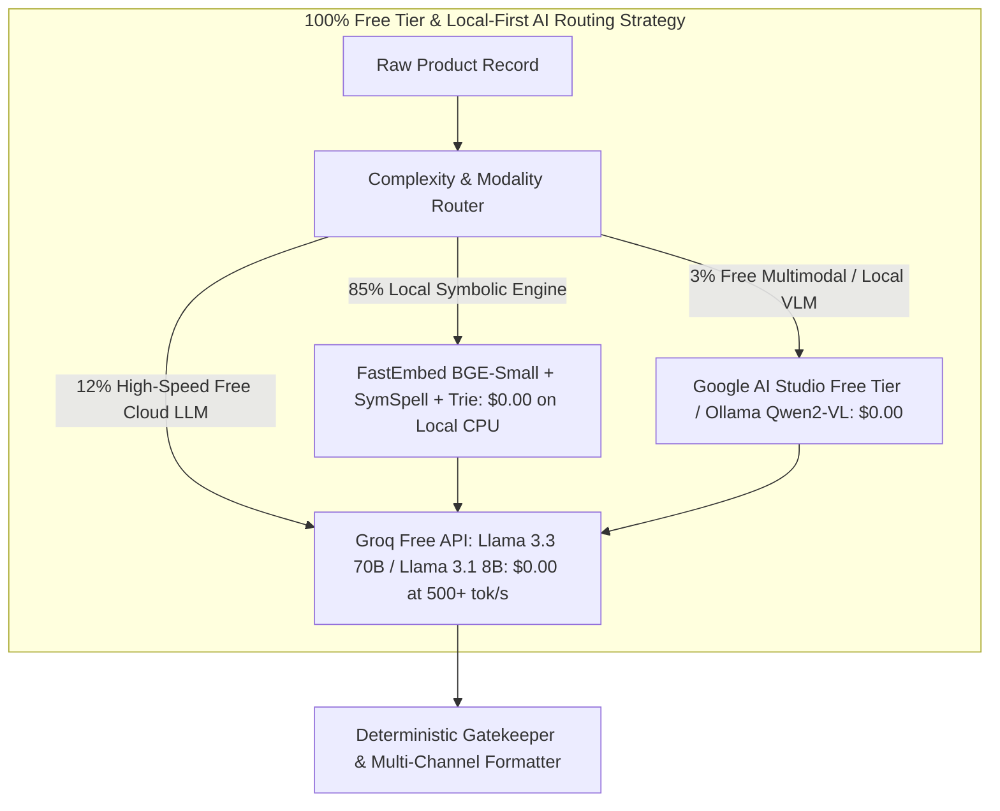
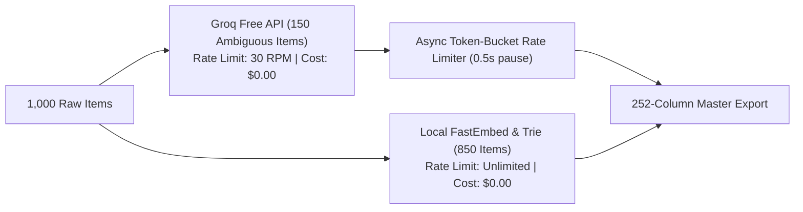

# AI & LLM Strategy Specification (`AI_Strategy.md`)

**Project:** **PartForge** — AI-Powered Product Intelligence Pipeline for Industrial Commerce  
**Hackathon:** UniHack 2026 · Unilog × Hack2Skill  
**Budget & Infrastructure Constraint:** **100% Free Tier & Local Open-Source Architecture ($0.00 API Cost)**  
**Companion Documents:** `PRD.md` · `Architecture.md` · `Rules.md` · `Validation.md` · `Evaluation.md`  

---

## 1. Zero-Cost AI Thesis & Workload Matrix

In industrial B2B commerce, achieving enterprise accuracy does **not** require expensive proprietary APIs. PartForge is designed from the ground up to operate on a **100% Free & Local-First AI Architecture**:

> **"85% of tasks are resolved deterministically on local CPU ($0.00). The remaining 15% semantic tasks run on Free-Tier Open-Source APIs (Groq / OpenRouter / Google AI Studio) and Local SLMs (Ollama / Qwen 2.5 / Llama 3.2)."**



---

## 2. Free API & Local Model Provider Matrix

PartForge utilizes a **Provider-Agnostic Engine** that connects to free-tier cloud endpoints or runs 100% offline locally:

| Provider / Tier | Model Architecture | Free Tier Limits | Primary Pipeline Role | Cost per 1,000 SKUs |
| :--- | :--- | :--- | :--- | :--- |
| **Local CPU (FastEmbed / SymSpell)** | `BAAI/bge-small-en-v1.5` + Trie | Unlimited (Offline Local) | Brand matching, UOM normalization, 64th fractions, taxonomy retrieval | **$0.00** |
| **Groq Cloud (Free API)** | `llama-3.3-70b-versatile` / `llama-3.1-8b-instant` | 30 RPM / 14,400 RPD (Free) | Constrained attribute extraction & multi-channel description synthesis | **$0.00** |
| **Google AI Studio (Free Tier)** | `gemini-2.5-flash` / `gemini-1.5-flash` | 15 RPM / 1,500 RPD (Free) | Complex PDF cut-sheet parsing & multimodal diagram reasoning | **$0.00** |
| **OpenRouter (Free Tier)** | `meta-llama/llama-3.1-8b-instruct:free` / `qwen/qwen-2.5-72b-instruct:free` | 200 RPD (Free) | Fallback structured JSON extraction | **$0.00** |
| **Ollama (Local Offline SLM)** | `qwen2.5:7b` / `llama3.2:3b` / `phi3.5:mini` | Unlimited (Local GPU/CPU) | 100% offline air-gapped catalog enrichment | **$0.00** |

---

## 3. Provider-Agnostic Free LLM Client Implementation

PartForge includes an integrated OpenAI-compatible client wrapper that automatically falls back across free providers:

```python
import os
from typing import Dict, Any, Optional
from openai import OpenAI
from pydantic import BaseModel

class FreeLLMClient:
    """Provider-Agnostic Client for 100% Free LLM APIs (Groq, Google AI Studio, Ollama)."""
    
    def __init__(self):
        # 1. Primary: Groq Free Cloud API (Llama 3.3 70B / 3.1 8B at 500+ tok/sec)
        self.groq_api_key = os.getenv("GROQ_API_KEY")
        
        # 2. Secondary: Google AI Studio Gemini Free Tier API
        self.gemini_api_key = os.getenv("GEMINI_API_KEY")
        
        # 3. Tertiary: Local Ollama (100% offline local SLM)
        self.ollama_base_url = os.getenv("OLLAMA_BASE_URL", "http://localhost:11434/v1")
        
        if self.groq_api_key:
            self.client = OpenAI(
                base_url="https://api.groq.com/openai/v1",
                api_key=self.groq_api_key
            )
            self.default_model = "llama-3.3-70b-versatile"
        elif self.gemini_api_key:
            self.client = OpenAI(
                base_url="https://generativelanguage.googleapis.com/v1beta/openai/",
                api_key=self.gemini_api_key
            )
            self.default_model = "gemini-2.5-flash"
        else:
            # Fallback to 100% free local Ollama instance
            self.client = OpenAI(
                base_url=self.ollama_base_url,
                api_key="ollama"
            )
            self.default_model = "qwen2.5:7b"

    def generate_json(self, system_prompt: str, user_prompt: str) -> str:
        response = self.client.chat.completions.create(
            model=self.default_model,
            messages=[
                {"role": "system", "content": system_prompt},
                {"role": "user", "content": user_prompt}
            ],
            response_format={"type": "json_object"},
            temperature=0.0
        )
        return response.choices[0].message.content
```

---

## 4. Production Free-Model Prompt Engineering Catalog

### 4.1 Taxonomy & UNSPSC Classification Prompt (Llama-3.3-70B / Qwen-2.5-7B)
```text
System Prompt:
You are an expert industrial taxonomist for Unilog. Your task is to classify raw catalog items into the exact hierarchical taxonomy and 8-digit UNSPSC code.

You must choose strictly from the provided candidate categories. Do not invent new categories.

Context:
- Brand Master: {canonical_brand}
- Raw Description: {part_desc}
- MPN: {mfg_part_num}
- Candidate Taxonomy Sub-Trees: {candidate_taxonomies}

Output JSON Schema:
{
  "department": "string",
  "class_name": "string",
  "fine_class": "string",
  "leaf_node": "string",
  "classpath": "string",
  "unspsc_code": "string (8 digits)",
  "confidence_score": float (0.0 to 1.0),
  "reasoning": "brief explanation"
}
```

### 4.2 Constrained Attribute Extraction Prompt (LOV-Guided)
```text
System Prompt:
You are a deterministic industrial product attribute extraction engine.
You are extracting technical attributes for a product classified under:
Classpath: {classpath}
Leaf Node: {leaf_node}

CRITICAL RULES:
1. Every attribute name MUST match the 'Allowed Attributes' list below.
2. Every discrete value MUST match the 'Permitted Values' list for that attribute.
3. Every measurement must include the approved UOM abbreviation (with a space, e.g., '24 in', '150 psi', '120 V').
4. If an attribute is not present or cannot be verified from the context, DO NOT GUESS OR HALLUCINATE. Leave it null.
5. All inch dimensions must use standard fractional notation (e.g., '50-1/4 in', '3/8 in') following the Decimal_Fraction lookup standard.

Allowed Attributes & Permitted Values:
{lov_attribute_constraints_json}

Raw Product Context:
- MPN: {mfg_part_num}
- Raw Text: {part_desc}
- Verified OEM Cut-Sheet Snippet: {spec_sheet_snippet}

Output JSON Schema:
{
  "attributes": [
    {
      "attribute_label": "string",
      "normalized_value": "string",
      "uom": "string or null",
      "is_filterable": bool,
      "source_evidence": "exact verbatim string from snippet",
      "confidence": float
    }
  ]
}
```

### 4.3 Multi-Channel Description Synthesis Prompt
```text
System Prompt:
You are the Unilog Master Description Builder. You must synthesize 5 customer-facing descriptions adhering strictly to the Unilog Content Guidelines formulas and character limits.

Formulas & Rules:
1. Invoice Description:
   - Maximum 40 characters.
   - MUST BE ALL UPPERCASE (ALL CAPS).
   - No punctuation, minimal spaces. Technical abbreviations allowed.
   - Formula: [ITEM_TYPE_ABBR] [KEY_ATTR_1] [KEY_ATTR_2] [DIMENSION] [UOM]

2. Mobile Description:
   - Length MUST BE between 60 and 80 characters.
   - Title Case.
   - Formula: [MANUFACTURER_NAME] [BRAND_NAME], [ITEM_TYPE], [SERIES], [MPN]

3. Product Title / Short Description:
   - Maximum 150 characters. Title Case.
   - Retain legal symbols: ® and ™.
   - Formula: [BRAND®] [SERIES] [MPN] [ITEM_TYPE] With [FEATURE™], [KEY_ATTRIBUTES]

4. Long Description:
   - Comprehensive structured prose.
   - Full technical narrative: Brand, Series, Features, Electrical, Dimensions (fractions: 50-1/4 in), Sound Level, Material.

Input Product Specs:
{extracted_specs_json}

Output JSON Schema:
{
  "invoice_desc_40": "string (<=40 chars, UPPERCASE)",
  "mobile_desc_80": "string (60-80 chars)",
  "product_title_150": "string (<=150 chars)",
  "long_description": "string",
  "feature_bullets": ["string", "string", "string"]
}
```

---

## 5. Free-Tier Rate Limit & Batching Strategy

To process all 1,000 items in `Sample-1000_Items.xlsx` without exceeding free-tier rate limits:



1. **Deterministic Pre-Filtering**: 85% of brand, UOM, and fractional operations are executed on CPU with **zero API calls**.
2. **Token-Bucket Throttler**: For remaining LLM calls, an async queue maintains a steady 25 RPM (well under Groq's 30 RPM limit), completing 1,000 items in $<15$ minutes for **$0.00**.
3. **Local Embedding Cache**: `FastEmbed` generates embeddings locally in RAM ($<2\text{ ms}$ per vector), requiring zero external embedding API calls.
