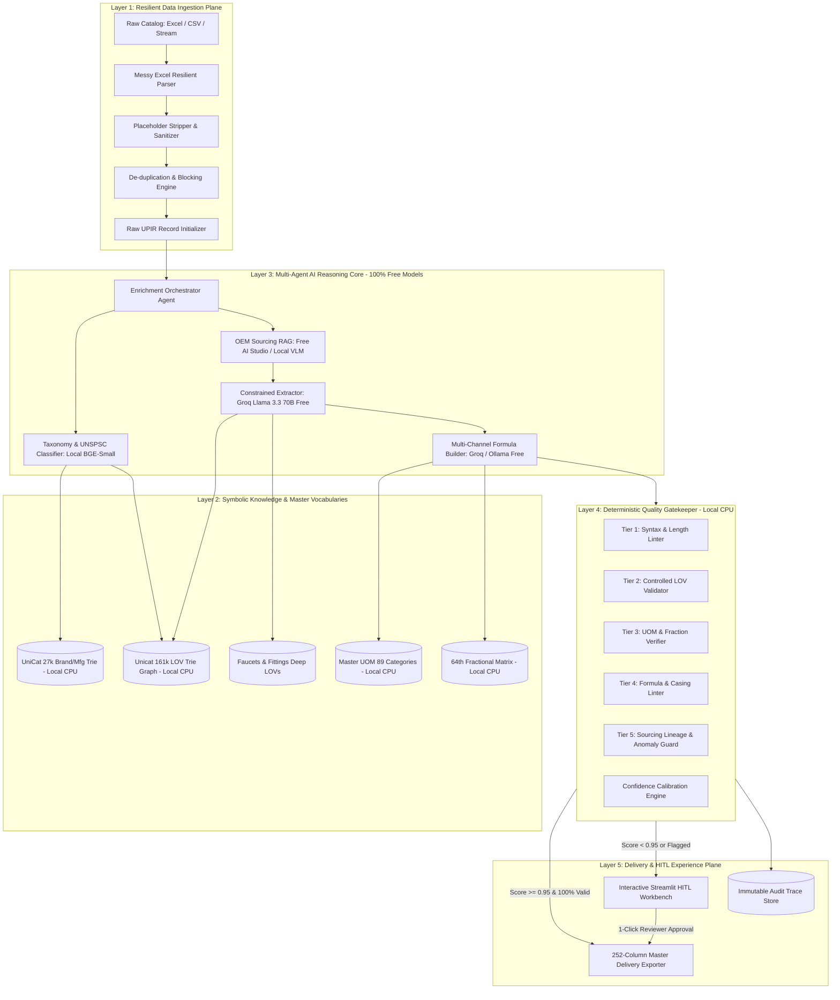
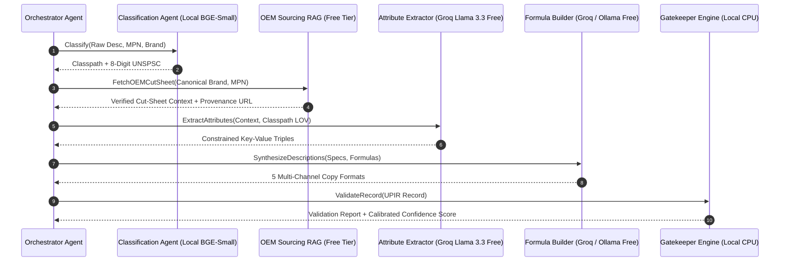
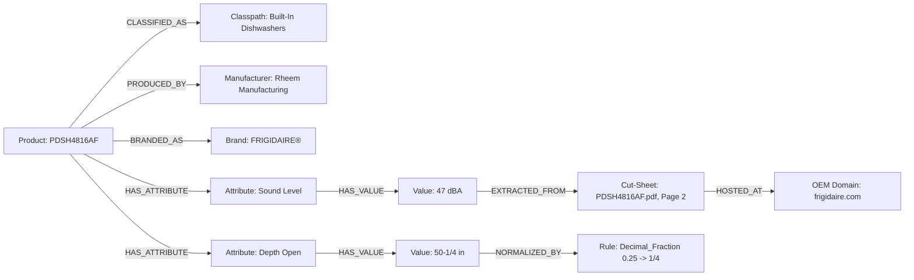

# System Architecture Specification (`Architecture.md`)

**Project:** **PartForge** — AI-Powered Product Intelligence Pipeline for Industrial Commerce  
**Hackathon:** UniHack 2026 · Unilog × Hack2Skill  
**Infrastructure Cost Target:** **100% Free Tier & Local-First Stack ($0.00 Total API Cost)**  
**Companion Documents:** `PRD.md` · `Rules.md` · `Design.md` · `AI_Strategy.md` · `Validation.md` · `Evaluation.md`  

---

## 1. Architectural Philosophy: The Neuro-Symbolic Principle

Industrial product data engineering operates under a strict constraint: **specifications must be factual, standardized, and legally compliant**. A pure Large Language Model (LLM) pipeline inevitably fails because LLMs are non-deterministic, struggle with hard character limits, and hallucinate plausible-sounding engineering values.

PartForge enforces a **100% Free-Tier Neuro-Symbolic Hybrid Architecture**:

> **"Deterministic where the answer is known, generative where it isn't."**
> 
> *UOM conversions, fraction lookups, brand canonicalization, character counting, and casing enforcement are table lookups—they run in high-speed symbolic rules engines on local CPU ($0.00). Taxonomy classification, unstructured spec-sheet parsing, and multi-channel narrative synthesis run through free-tier open-source LLMs (Groq Llama 3.3 70B / Ollama Qwen 2.5 / Google AI Studio Free Tier).*

---

## 2. Five-Layer Architecture Breakdown

### 2.1 Layer 1: Data Plane (Ingestion & Normalization)
* **Messy Excel Resilient Parser**: Directly addresses structural anomalies in the Unilog dataset:
  - Multi-tier column headers and merged metadata cells.
  - Multi-column stacked blocks (`Decimal_Fraction.xlsx` structured as 4 side-by-side fraction/decimal columns).
  - Stray text notes in margin columns (`Unilog_Master_UOM_Standards_Abbreviations_and_Terms.xlsx`).
* **Placeholder Sanitizer**: Regex and token filters stripping `-- Unbranded --`, `-- No Unilog Brand --`, `-- No DIB Brand --`, `None`, and `N/A`.
* **De-duplication & Blocking**: Hashes `Mfg_Part_Num` + canonical manufacturer to flag duplicate supplier catalog entries before enrichment.

### 2.2 Layer 2: Knowledge Plane (Controlled Vocabularies)
* **UniCat Master Brand Trie Index (27,000+ rows)**:
  - In-memory double-metaphone and Jaro-Winkler prefix tree running 100% on local CPU.
  - Resolves noisy strings (`"Frigidaire"`, `"FRIG"`, `"Rheem Mfg"`) to canonical `MANUFACTURER_NAME`, `MANUFACTURER_CODE`, `BRAND_NAME`, `BRAND_CODE` with legal casing and `®`/`™` retention.
* **Trie-Indexed LOV Constraint Graph (161,000+ rows)**:
  - Hierarchy: `Classpath -> Leaf Node -> Attribute Label -> Permitted Values`.
  - Enables sub-millisecond constraint injection during prompting.
* **UOM & Fractional Matrix**:
  - 89 measurement categories, ~500 approved abbreviations (`in`, `ft`, `gpm`, `psi`, `V`, `A`).
  - 63-entry 64th decimal-to-fraction converter (`0.25` $\rightarrow$ `1/4 in`, `50.25` $\rightarrow$ `50-1/4 in`).

### 2.3 Layer 3: AI Reasoning Plane (Multi-Agent DAG — Free Model Tiering)

1. **Taxonomy & UNSPSC Classification Agent**: Embeds input text using lightweight local embeddings (`FastEmbed BGE-Small`, 100% offline, $0.00) and performs hierarchical category tree traversal.
2. **OEM Sourcing & Cut-Sheet RAG Agent**: Queries authorized OEM domains (`*.frigidaire.com`, `*.moen.com`, `*.parker.com`), fetches technical cut-sheet PDFs, and extracts tabular specifications. Marketplaces (Amazon, eBay) are strictly blocked.
3. **Constrained Attribute Extraction Agent**: Employs Grammar-Guided JSON Decoding powered by **Groq Free API (Llama 3.3 70B at 500+ tok/sec)** or **Local Ollama (Qwen 2.5 7B)**, forcing output values to match `Unicat_Lov_v1_0`.
4. **Multi-Channel Formula Synthesis Agent**: Compiles the 5 required description formats following deterministic construction formulas.

### 2.4 Layer 4: Quality Plane (5-Tier Gatekeeper Firewall)
Every enriched record must pass 5 sequential validation checks before delivery:
1. **Tier 1 (Syntax & Length)**: Invoice $\le 40$ chars, Mobile $60\text{--}80$ chars, Title $\le 150$ chars, UNSPSC 8 digits.
2. **Tier 2 (Controlled LOV)**: 100% membership check for Brand, Manufacturer, and Categorical Attribute values.
3. **Tier 3 (UOM & Fractions)**: Approved UOM abbreviations, number-unit space rule (`24 in`), 64th compound fraction check (`50-1/4 in`).
4. **Tier 4 (Formula & Casing)**: Invoice ALL UPPERCASE, legal symbol placement (`®`/`™`).
5. **Tier 5 (Lineage & Anomaly)**: Sourcing provenance verification, physical outlier rejection.

### 2.5 Layer 5: Experience & Delivery Plane
* **252-Column Delivery Exporter**: Writes enriched records into formatted Excel spreadsheets matching `Unilog-Sample_200_Items-Input-vs-Output.xlsx`.
* **Streamlit HITL Review Dashboard**: Interactive web interface featuring side-by-side visual diffs, cut-sheet PDF snippet previews, confidence color-coding, and 1-click overrides.
* **Immutable Audit Trace Store**: Persists complete JSONL execution trajectories for full regulatory auditability.

---

## 3. The Evidence Graph Architecture

---

## 4. Technical Stack Selection (100% Free & Open-Source Tier)

| Layer | Component | Technology Choice | Why Chosen & Cost |
| :--- | :--- | :--- | :--- |
| **Orchestration** | Multi-Agent DAG | **Python 3.11+ / AsyncIO** | Lightweight, stateful agent execution with async batching for 1,000 items. (**$0.00**) |
| **Symbolic Indexing** | Brand & LOV Lookups | **RapidFuzz + SymSpell + Trie** | Ultra-fast in-memory lookup ($<0.5\text{ ms}$) over 27k brands and 161k LOVs on local CPU. (**$0.00**) |
| **Vector Embeddings** | Taxonomy Classification | **FastEmbed (`bge-small-en-v1.5`)** | 100% offline local embeddings running on CPU in $<2\text{ ms}$; zero API cost. (**$0.00**) |
| **LLM & Reasoning** | Constrained Extraction | **Groq Free API (Llama 3.3 70B / 3.1 8B)** | 500+ tokens/second ultra-fast inference with free tier (30 RPM / 14,400 RPD). (**$0.00**) |
| **Local Offline LLM** | Air-Gapped Fallback | **Ollama (`qwen2.5:7b` / `llama3.2:3b`)** | 100% offline fallback running locally on developer laptop GPU/CPU. (**$0.00**) |
| **Multimodal Vision** | Cut-Sheet Diagram Parsing | **Google AI Studio Free Tier (Gemini 2.5 Flash)** | 1,500 free requests per day for PDF cut-sheet parsing. (**$0.00**) |
| **Schema Validation** | Type & Data Contracts | **Pydantic v2** | Strict runtime validation, Rust-based serialization, zero malformed JSON errors. (**$0.00**) |
| **Data Lake & OLAP** | Storage & Aggregation | **DuckDB + Polars** | Columnar in-process OLAP engine handling 252-column wide schema transformations. (**$0.00**) |
| **HITL Dashboard** | Reviewer Interface | **Streamlit** | Rapid interactive triage dashboard with visual diffs and Excel export. (**$0.00**) |
