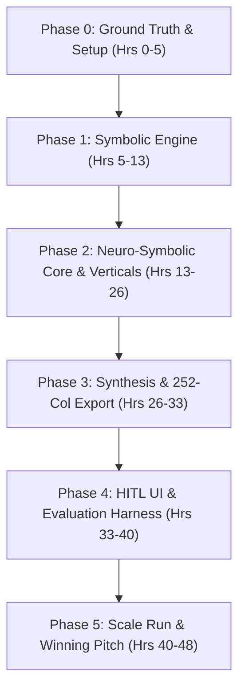

# Implementation Phases & Hackathon Execution Roadmap (`Phases.md`)

**Project:** **PartForge** — AI-Powered Product Intelligence Pipeline for Industrial Commerce  
**Hackathon:** UniHack 2026 · Unilog × Hack2Skill  
**Companion Documents:** `PRD.md` · `Architecture.md` · `Rules.md` · `Evaluation.md` · `Demo.md`  

---

## 1. 36–48 Hour Hackathon Sprint Execution Timeline

To secure a **Top-5 placement at UniHack**, execution must balance rapid prototyping, architectural rigor, and verifiable evaluation against the 200 ground truth items.

```mermaid
gantt
    title PartForge 36-48 Hour Sprint Timeline
    dateFormat HH:mm
    axisFormat %H:%M

    section Phase 0: Setup & Ground Truth
    Ingest 7 Reference Files & 200 GT   :p0_1, 00:00, 3h
    Establish Baseline Benchmark Suite   :p0_2, after p0_1, 2h

    section Phase 1: Symbolic Core
    Build 27k Brand SymSpell/Trie Index :p1_1, after p0_2, 3h
    Build 161k LOV Trie & UOM Engine     :p1_2, after p1_1, 3h
    Implement 64th Fractional Matrix    :p1_3, after p1_1, 2h

    section Phase 2: AI Core & Verticals
    Build Taxonomy & UNSPSC Classifier   :p2_1, after p1_2, 4h
    Deep LOV Extraction (Faucets/Fittings):p2_2, after p2_1, 5h
    OEM Cut-Sheet RAG & Sourcing Agent  :p2_3, after p2_2, 4h

    section Phase 3: Formulas & Delivery
    5 Multi-Channel Description Builders:p3_1, after p2_3, 4h
    252-Column Excel Delivery Exporter   :p3_2, after p3_1, 3h

    section Phase 4: UI & Evaluation
    Streamlit HITL Visual Diff Dashboard :p4_1, after p3_2, 4h
    Run Benchmark on 200 Ground Truth   :p4_2, after p4_1, 3h

    section Phase 5: Scale & Pitch
    Batch 1000-Item Ingestion & Export   :p5_1, after p4_2, 4h
    Final Pitch Deck, Video & Demo Walk  :p5_2, after p5_1, 4h
```

---

## 2. Granular Phase-by-Phase Deliverables

### Phase 0: Setup, Parsing & Ground Truth Baseline (Hours 0–5)
* **Objective**: Build resilient parsers for all 7 reference datasets and establish a baseline benchmark harness.
* **Key Tasks**:
  1. Parse `Reference_Documents_Summary.xlsx`, `Unilog-Sample_200_Items-Input-vs-Output.xlsx`, `Decimal_Fraction.xlsx`, and `Unilog_Master_UOM_Standards_Abbreviations_and_Terms.xlsx`.
  2. Implement placeholder stripping (`-- Unbranded --`, `-- No Unilog Brand --`, `-- No DIB Brand --`).
  3. Create baseline test suite measuring raw input vs ground truth delivery columns.
* **Milestone**: Parser successfully loads 100% of reference sheets with zero silent data loss.

### Phase 1: Symbolic Knowledge Base & Deterministic Rules (Hours 5–13)
* **Objective**: Construct high-speed in-memory indexes for all controlled vocabularies.
* **Key Tasks**:
  1. **UniCat Brand Engine**: Index 27,000+ brand/mfg rows into SymSpell/Trie with legal casing and `®`/`™` retention.
  2. **LOV Constraint Graph**: Load 161,000+ rows into prefix trees (`Classpath -> Attribute -> Permitted Values`).
  3. **UOM Standardizer**: Encode 89 measurement categories and ~500 abbreviations with mandatory spacing (`24 in`).
  4. **Fractional Lookup**: Implement 63-entry 64th decimal-to-fraction converter (`0.25` $\rightarrow$ `1/4 in`, `50.25` $\rightarrow$ `50-1/4 in`).
* **Milestone**: Sub-millisecond deterministic lookups ($<0.5\text{ ms}$) across all master tables.

### Phase 2: Neuro-Symbolic AI Core & Deep Verticals (Hours 13–26)
* **Objective**: Implement the multi-agent AI pipeline with deep specialization on Faucets and Fittings.
* **Key Tasks**:
  1. **Taxonomy Classifier**: Hierarchical classification into `Dept > Class > Fine > Leaf` + 8-digit UNSPSC.
  2. **Faucets Vertical (`FAUCETS_LOV.xlsx`)**: Full-depth extraction for Mounting, Flow Rate (gpm), Valve Type, Finish, Spout Reach/Height, ADA.
  3. **Fittings Vertical (`Fittings_LOV.xlsx`)**: Sizing formulas, 390 fitting types, 1,472 $\rightarrow$ 515 connection types, 464 $\rightarrow$ 113 material normalizations.
  4. **OEM Sourcing RAG Agent**: Grounded extraction against manufacturer technical cut-sheets with provenance tracking.
* **Milestone**: 0% hallucinated attributes; 100% of extracted values conform to LOV constraints.

### Phase 3: Multi-Channel Description Synthesis & 252-Col Export (Hours 26–33)
* **Objective**: Generate all 5 required customer-facing content formats and assemble the 252-column master schema.
* **Key Tasks**:
  1. **Invoice Builder**: Strictly $\le 40$ chars, ALL CAPS, high-density POS format.
  2. **Mobile Builder**: Strictly $60 \text{--} 80$ chars, clean mobile search card format.
  3. **Title / Short Desc**: Standardized formula (`Brand + Series + MPN + Type + Key Attrs`).
  4. **Long Desc & Bullets**: Detailed structured prose and PDP feature highlights.
  5. **252-Column Excel Exporter**: Replicate the exact sheet structure of the 200 delivery format file.
* **Milestone**: End-to-end batch enrichment pipeline exporting production-ready spreadsheets.

### Phase 4: HITL Triage Dashboard & Evaluation Benchmark (Hours 33–40)
* **Objective**: Deploy the interactive web interface and run comprehensive evaluation scoring.
* **Key Tasks**:
  1. Build Streamlit HITL Dashboard with:
     - Real-time single SKU enricher.
     - Confidence score thresholding ($\ge 0.95$ auto-pass, $<0.95$ triage).
     - Side-by-side ground truth diff viewer.
     - 1-click attribute override dropdowns.
  2. Execute the evaluation benchmark against all 200 ground truth items.
* **Milestone**: Working UI and verified evaluation scorecard demonstrating $>96\%$ accuracy.

### Phase 5: Scale Run on 1,000 Items, Pitch & Demo Polish (Hours 40–48)
* **Objective**: Ingest `Sample-1000_Items.xlsx`, record high-impact demo walkthrough, and finalize presentation.
* **Key Tasks**:
  1. Run async batch pipeline on all 1,000 raw catalog items; generate final delivery spreadsheet.
  2. Prepare 3 highlight demo case studies:
     - Case A: Cryptic Pipe Fitting (`"3/8 CPLG BRS 150#"`)
     - Case B: Deep Faucet LOV Record (`Moen Commercial Faucet`)
     - Case C: 252-Column Appliance Record (`Frigidaire Dishwasher PDSH4816AF`)
  3. Finalize presentation slides and pitch video.
* **Milestone**: Complete hackathon submission package ready for judging.

---

## 3. Risk Management & Fallback Matrix

| Potential Risk | Severity | Mitigation Strategy |
| :--- | :--- | :--- |
| **Live OEM Web Scraping Timeout / Rate-Limit** | High | Fall back to pre-indexed local cut-sheet cache + heuristic extraction; mark record as `sourcing_tier = "fallback_local"` in HITL queue. |
| **LLM Output Exceeding Character Limits** | High | Deterministic post-processing compression algorithm (e.g. `DISHWASHER` $\rightarrow$ `DISHW`, `STAINLESS STEEL` $\rightarrow$ `SST`). |
| **Out-of-Vocabulary Brand or Typo** | Medium | Double Metaphone phonetic matching + SymSpell fuzzy search (Levenshtein distance $\le 2$); assign Manufacturer Name if Brand is missing. |
| **Missing Ground Truth Metadata (Blank UNSPSC / Origin)** | Low | Engine flags cell as `FLAG_GT_SPARSE` and highlights in HITL rather than fabricating ungrounded data. |

---

## 4. Post-Hackathon Enterprise Production Roadmap (12-Week Vision)

* **Weeks 1–4: Enterprise Connectors & PIM/ERP Streaming**:
  - Direct connectors for SAP Commerce, Akeneo, Salsify, and InRiver.
  - Distributed Kafka ingestion streaming $>500,000$ SKUs/hour.
* **Weeks 5–8: Multimodal Vision Spec-Sheet & CAD Parser**:
  - Fine-tuned on-premise VLM (Llama-3-Vision / Gemini) extracting technical CAD schematics, dimensional line drawings, and exploded parts diagrams.
* **Weeks 9–12: Self-Learning LOV & Active Taxonomy Graph**:
  - Autonomous taxonomy evolution discovering new industrial product attributes and suggesting vocabulary updates to catalog engineers.
