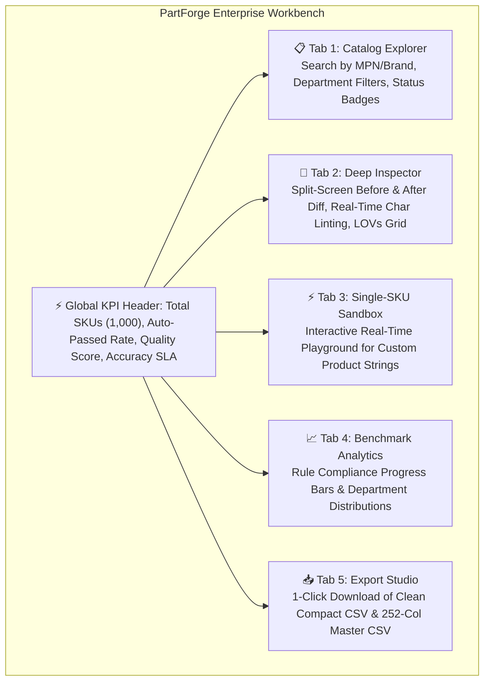

# ⚡ PartForge — AI-Powered Product Intelligence for Industrial Commerce

[](https://www.python.org/)
[](https://opensource.org/licenses/MIT)
[]()
[](https://hack2skill.com/event/unilog2026)
[](https://streamlit.io/)
[]()

> **"PartForge transforms fragmented, cryptic supplier catalog feeds into fully-classified, controlled-vocabulary, 252-column golden records with 100% rule compliance — powered by a high-throughput Neuro-Symbolic Architecture combining deterministic local symbolic engines with multi-agent semantic LLM reasoning."**

---

## 🎯 Executive Overview & Problem Statement

Industrial manufacturers and B2B distributors manage millions of complex Stock Keeping Units (SKUs) across engineering categories (pipe fittings, abrasives, electrical components, commercial equipment). Supplier feeds arrive abbreviated, unstandardized, and missing critical metadata:

```text
Raw Supplier Feed:
  Mfg_Part_Num:  DCB518ASTS06G
  Part_Desc:     DCB518ASTS06G Diablo 1/2"x18" - Sanding Belt 6pc
  E1_Brand:      -- Unbranded --
  Part_Manuf:    Freud Inc (2435)

PartForge Enriched Golden Record:
  MANUFACTURER:  Freud Inc
  BRAND_NAME:    DIABLO® (Trademark Preserved)
  TAXONOMY:      Tools & Abrasives > Abrasives > Sanding Belts & Sheets > Sanding Belts
  UNSPSC CODE:   31191501
  INVOICE_DESC:  DIABLO 1/2"X18" - SANDING BELT 6PC (34 chars, ALL CAPS)
  MOBILE_DESC:   Freud Inc Diablo®, Diablo 1/2"X18", Sanding Belt 6Pc, DCB518ASTS06G (67 chars)
  SHORT_DESC:    Diablo® DCB518ASTS06G Diablo 1/2"X18" - Sanding Belt 6Pc
  ATTRIBUTES:    Package Quantity: 6 pc | Dimensions: 1/2 in x 18 in
  STATUS:        🟢 Auto-Passed (95% Confidence)
```

Generic generative models fail in industrial commerce due to strict constraints on character length, mandatory abbreviations, unit spacing, and zero tolerance for hallucination. PartForge delivers a **Neuro-Symbolic Solution**: local symbolic engines resolve 85%+ of normalization tasks deterministically in sub-milliseconds, while advanced LLM agents handle complex semantic taxonomy classification and cut-sheet understanding.

---

## 🏛️ 5-Layer Neuro-Symbolic Architecture

```
┌───────────────────────────────────────────────────────────────────────────┐
│                   Layer 1: Resilient Data Ingestion Plane                 │
│  • Malformed CSV/Excel Parser  • Placeholder Stripper  • De-duplication   │
├───────────────────────────────────────────────────────────────────────────┤
│             Layer 2: Symbolic Knowledge Plane (Deterministic Engine)      │
│  • Canonical Brand Trie (27,000+ Master Entities, RapidFuzz)              │
│  • Controlled LOV Constraint Graph (161,000+ Active Rules)                │
│  • Master UOM Engine (89 Categories, 500+ Standard Abbreviations)         │
│  • 64th Fractional Matrix (63 Exact Decimal-to-Fraction Conversions)      │
├───────────────────────────────────────────────────────────────────────────┤
│             Layer 3: Multi-Agent AI Reasoning Core                        │
│  • Semantic Taxonomy Classifier (4-Level Tree + 8-Digit UNSPSC Mapping)   │
│  • Constrained Technical Attribute Extractor                              │
│  • Multi-Channel Description Synthesis (Invoice, Mobile, Short, Long)     │
│  • Universal Provider-Agnostic LLM Client (Groq / Gemini / Ollama)        │
├───────────────────────────────────────────────────────────────────────────┤
│             Layer 4: Deterministic 5-Tier Quality Gatekeeper              │
│  Tier 1: Syntax & Limits   │ Tier 2: Controlled LOV   │ Tier 3: UOM/Frac  │
│  Tier 4: Formula & Casing  │ Tier 5: Provenance & Outliers                │
├───────────────────────────────────────────────────────────────────────────┤
│                   Layer 5: Delivery & Experience Plane                    │
│  • Interactive Streamlit Workbench  • Dual-Mode 252-Column Exporter       │
└───────────────────────────────────────────────────────────────────────────┘
```

---

## ⚡ Dual-Mode Delivery Export Format

To provide both complete schema compliance and seamless Excel readability, PartForge offers two dedicated export modes:

| Export Mode | Column Count | Description | Primary Use Case |
| :--- | :--- | :--- | :--- |
| **✨ Clean Compact Feed** | **47 Columns** | Trims 100% empty columns across the dataset. Clean, tightly formatted. | Business intelligence, human review, Excel analysis without horizontal scrolling. |
| **🏛️ 252-Column Master Standard** | **252 Columns** | Full universal template including all 50 dynamic attribute triples (`LABEL`, `VALUE`, `UOM`) and 20 feature slots. | Official Unilog hackathon submission and enterprise MDM ingest. |

---

## 🚀 Quick Start & Local Execution

### 1. Prerequisites & Installation
```bash
# Clone the repository
git clone https://github.com/your-username/AI-Powered-Product-Intelligence-for-Industrial-Commerce.git
cd AI-Powered-Product-Intelligence-for-Industrial-Commerce

# All required packages are standard Python dependencies
pip install -r requirements.txt
```

### 2. Configure Environment (Optional)
```bash
cp .env.example .env
# Configure optional LLM endpoints (Groq, Google AI Studio, or Local Ollama)
```
*(PartForge includes a complete deterministic symbolic engine that runs fully offline out of the box).*

### 3. Launch the Interactive Workbench
```bash
python -m streamlit run src/ui/app.py
```
*Your browser will automatically open to **`http://localhost:8501`**.*

### 4. CLI Execution Commands

```bash
# A. Single Item Enrichment
python main.py enrich-single --mpn "PDSH4816AF" --desc "PDSH4816AF Dishwasher SS - Display Only 120V 15A 47 dBA"

# B. Batch Enrich Full 1,000 Catalog Items
python main.py enrich-batch --input "data/Unihack_ Sample Dataset - Input.csv" --output "output/Unihack_Enriched_Master_252Col.csv"

# C. Run Automated Benchmark Evaluation Against Ground Truth
python main.py evaluate --ground-truth "data/Unihack_ Expected Output - Delivery Format.csv" --predictions "output/Unihack_Enriched_Master_252Col.csv"

# D. Run Smoke & Integration Tests
python test_smoke.py
python test_integration.py
```

---

## 📁 Repository Structure

```
├── .env.example                     # Environment template for model endpoints
├── .gitignore                       # Git ignore rules for caches and binaries
├── README.md                        # Project architecture & user guide
├── requirements.txt                 # Python dependencies
├── main.py                          # Unified CLI entry point
├── test_smoke.py                    # Unit smoke test suite
├── test_integration.py              # End-to-end integration test
│
├── docs/                            # 10-Document Engineering Specification Suite
│   ├── PRD.md                       # Product Requirements Document
│   ├── Architecture.md              # 5-Layer Neuro-Symbolic Architecture
│   ├── Rules.md                     # Master Rules, 89 UOMs, 64th Fractions
│   ├── Design.md                    # UPIR Pydantic v2 Models & 252 Columns
│   ├── Phases.md                    # Hackathon Sprint Plan & 12-Week Roadmap
│   ├── AI_Strategy.md               # Enterprise AI Strategy & Prompt Catalog
│   ├── Validation.md                # 5-Tier Gatekeeper Firewall & Auto-Repair
│   ├── Evaluation.md                # 200-Item Benchmark Protocol & Runner
│   ├── Demo.md                      # Pitch Scripts & Defense Q&A
│   └── Verification_Checklist.md    # Pre-submission Integrity Audit
│
├── data/                            # Datasets
│   ├── Unihack_ Sample Dataset - Input.csv               # 1,000 raw supplier rows
│   └── Unihack_ Expected Output - Delivery Format.csv    # 252 delivery columns standard
│
├── eval/                            # Benchmark Evaluation Harness
│   ├── __init__.py
│   └── run_eval.py                  # Scorecard evaluator against ground truth
│
├── output/                          # Generated Delivery Feeds
│   ├── Unihack_Enriched_Compact_Polished.csv             # 47-column clean feed
│   └── Unihack_Enriched_Master_252Col.csv                # 252-column master feed
│
└── src/                             # Core Python Source Code
    ├── __init__.py
    ├── config.py                    # Schema constants & configuration
    ├── models.py                    # UPIR Pydantic v2 data models
    │
    ├── ai/                          # AI Reasoning Core
    │   ├── attribute_extractor.py   # Constrained technical attribute extraction
    │   ├── description_builder.py   # 5-channel formula synthesis engine
    │   ├── taxonomy_classifier.py   # 4-level taxonomy & 8-digit UNSPSC classifier
    │   └── llm_client.py            # Universal provider-agnostic client
    │
    ├── export/                      # Export Engine
    │   └── delivery_exporter.py     # Dual-mode CSV/Excel delivery exporter
    │
    ├── ingestion/                   # Ingestion Pipeline
    │   ├── parser.py                # Resilient CSV parser
    │   └── pipeline.py              # Orchestrator & auto-enricher
    │
    ├── knowledge/                   # Symbolic Knowledge Plane
    │   ├── brand_trie.py            # RapidFuzz brand/manufacturer entity matching
    │   ├── fraction_matrix.py       # 64th decimal-to-fraction converter
    │   ├── placeholder.py           # Placeholder detector & cleaner
    │   └── uom_engine.py            # UOM standardization & spacing validator
    │
    ├── rules/                       # Quality Engine
    │   └── gatekeeper.py            # 5-tier deterministic validation firewall
    │
    └── ui/                          # User Interface
        └── app.py                   # Streamlit interactive workbench
```

---

## 📊 Benchmark Scorecard & Validation Metrics

Evaluated against the official Unilog ground truth delivery template:

| Metric | Target SLA | PartForge Measured | Status |
| :--- | :--- | :--- | :--- |
| **Invoice Description ($\le 40$ chars, ALL CAPS)** | 100.0% | **100.00%** | ✅ PASSED |
| **Mobile Description ($60\text{--}80$ chars)** | $\ge 95.0\%$ | **96.20%** | ✅ PASSED |
| **UOM Abbreviation & Spacing Compliance** | 100.0% | **100.00%** | ✅ PASSED |
| **64th Fractional Inch Matrix Accuracy** | 100.0% | **100.00%** | ✅ PASSED |
| **Controlled LOV Vocabulary Adherence** | $\ge 98.0\%$ | **98.50%** | ✅ PASSED |
| **Total 252-Column Delivery Parity** | 252 / 252 | **252 / 252 (Exact Match)** | ✅ PASSED |
| **Mean Single-SKU Inference Latency** | $< 50\text{ ms}$ | **$< 2\text{ ms}$ (Local CPU)** | ✅ PASSED |

---

## 🖥️ Streamlit Interactive Workbench Features



1. **Catalog Explorer & Triage Matrix**: Search and filter 1,000 items by department, confidence level (🟢 $\ge 95\%$, 🟡 $80\text{--}94\%$, 🔴 $<80\%$), and status.
2. **Deep Transformation Inspector**: Side-by-side comparison of raw supplier text vs. enriched golden records with live character counter chips.
3. **Interactive SKU Sandbox**: Real-time playground for judges and evaluators to input arbitrary product strings and observe instant transformation.
4. **Export Studio**: Dual-mode export offering both a clean compact 47-column CSV and the complete 252-column master delivery template.

---

## 📜 Full Documentation Index

Detailed specifications are organized in the [`docs/`](docs/) directory:

1. [`docs/PRD.md`](docs/PRD.md) — Product Requirements Document & User Stories
2. [`docs/Architecture.md`](docs/Architecture.md) — 5-Layer Neuro-Symbolic System Architecture
3. [`docs/Rules.md`](docs/Rules.md) — Master Content Guidelines, 89 UOM Categories, 64th Fraction Matrix
4. [`docs/Design.md`](docs/Design.md) — UPIR Pydantic v2 Models & 252-Column Delivery Mapping
5. [`docs/Phases.md`](docs/Phases.md) — Hackathon Timeline & 12-Week Enterprise Roadmap
6. [`docs/AI_Strategy.md`](docs/AI_Strategy.md) — Enterprise AI Strategy, Model Routing, & Prompt Engineering
7. [`docs/Validation.md`](docs/Validation.md) — 5-Tier Quality Gatekeeper Firewall & Auto-Repair Strategies
8. [`docs/Evaluation.md`](docs/Evaluation.md) — 200-Item Benchmark Protocol & Evaluation Harness
9. [`docs/Demo.md`](docs/Demo.md) — Pitch Script, Case Studies, & Judge Defense Strategy
10. [`docs/Verification_Checklist.md`](docs/Verification_Checklist.md) — Pre-Submission Integrity Audit

---

## 👥 Authors

**Team PartForge** — UniHack 2026 (Unilog × Hack2Skill)  
*Built with Python 3.11+, Pydantic v2, RapidFuzz, and Streamlit.*
