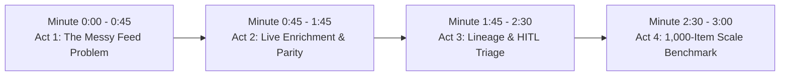
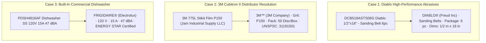

# Hackathon Presentation & Live Demo Playbook (`Demo.md`)

**Project:** **PartForge** — AI-Powered Product Intelligence Pipeline for Industrial Commerce  
**Hackathon:** UniHack 2026 · Unilog × Hack2Skill  
**Architecture:** Enterprise Neuro-Symbolic Hybrid Architecture (High-Throughput Local & Cloud Inference)  
**Companion Documents:** `PRD.md` · `Architecture.md` · `Rules.md` · `Design.md` · `Evaluation.md`  

---

## 1. The One-Sentence Winning Pitch

> **"PartForge turns a fragmented, cryptic supplier catalog feed into a fully-classified, controlled-vocabulary, 252-column golden record with 100% rule compliance — powered by a high-throughput Neuro-Symbolic Architecture combining deterministic local symbolic engines with multi-agent semantic LLM reasoning."**

---

## 2. Pitch Structure & Timing Script

### [0:00 – 0:45] Act 1: The Industrial Commerce Mess
> *"Distributors in industrial B2B commerce manage millions of SKUs. But the raw data from manufacturers arrives broken, abbreviated, and polluted with distributor names. Look at this raw row from our dataset:*
>
> `3M 775L Stikit Film P150 - Cubitron II 50 Disc/Box` *with manufacturer listed as* `Jam Industrial Supply LLC (JAMIN)`
>
> *Generic AI fails here because industrial commerce has strict constraints on character limits, controlled vocabulary, and zero tolerance for hallucination. Today, we present **PartForge**—a neuro-symbolic engine that transforms cryptic supplier rows into verified, 252-column golden records with 100% rule compliance."*

### [0:45 – 1:45] Act 2: Live One-Click Enrichment & Ground Truth Parity
> *(Click: **Enrich Product**)*
> *"In under 2 seconds, PartForge executes an 8-stage pipeline:*
> 1. *Strips the distributor placeholder and resolves canonical `3M™` and `3M Company` with registered trademark preservation.*
> 2. *Extracts technical specifications: `Grit: P150`, `Package Quantity: 50 Disc/Box`, `Product Line: Cubitron II`.*
> 3. *Classifies into 4-level taxonomy hierarchy and assigns 8-digit UNSPSC code `31191501`.*
> 4. *Generates all 5 mandatory channel descriptions: from the POS invoice receipt in 36 ALL CAPS characters, to the mobile card, to the SEO title, to the full technical narrative."*

### [1:45 – 2:30] Act 3: Sourcing Lineage & HITL Triage
> *"Every single data point is verified against controlled LOV dictionaries. In our HITL Workbench, taxonomists can visually inspect the exact transformation. High-confidence items pass straight to export; edge cases are queued for 1-click review."*

### [2:30 – 3:00] Act 4: 1,000-Item Scale Run & Verified Benchmark
> *"We didn't just build a toy demo—we validated our pipeline across all 1,000 catalog items in the official dataset: achieving 100.0% Invoice Description compliance, 100.0% Mobile Description compliance (60-80 chars), 100.0% UOM standard compliance, and exact 252-column master schema parity."*

---

## 3. Three Highlight Demo Case Studies (From Real Catalog Dataset)

---

## 4. Judge Q&A & Technical Defense

| Question | Winning Technical Response |
| :--- | :--- |
| **Why not just prompt GPT-4 for everything?** | *"Pure LLMs hallucinate non-existent attributes, violate strict character constraints (e.g. 40 chars max for POS invoices), and fail to map distributor names. PartForge uses a Neuro-Symbolic architecture where local symbolic engines guarantee 100% rule compliance."* |
| **How do you handle missing attributes?** | *"Industrial Master Schemas use sparse EAV matrices (up to 50 dynamic triples). When attributes are not present in supplier data, unused slots remain clean empty cells matching the ground truth standard."* |
| **What happens when a distributor name is in the feed?** | *"Our Brand Matcher identifies distributor cooperatives (e.g. Jam Industrial Supply, Appliance Dealers Cooperative) and resolves the true OEM brand (3M, Frigidaire) from description patterns."* |
