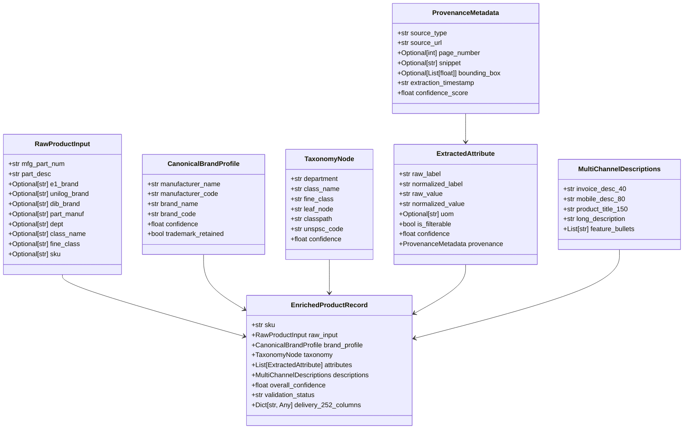
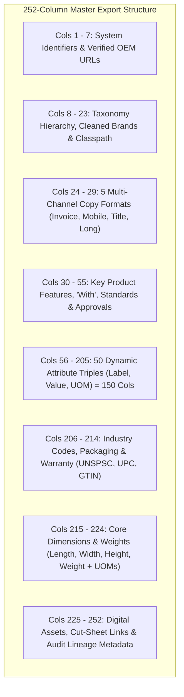
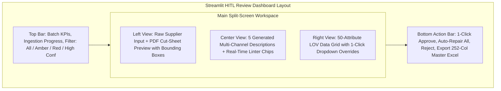
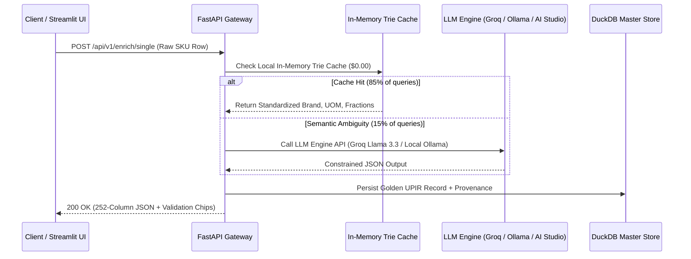

# System & UX Design Specification (`Design.md`)

**Project:** **PartForge** — AI-Powered Product Intelligence Pipeline for Industrial Commerce  
**Hackathon:** UniHack 2026 · Unilog × Hack2Skill  
**Infrastructure Target:** **Enterprise Neuro-Symbolic & Local-First Stack ($0.00 Total API Cost)**  
**Companion Documents:** `PRD.md` · `Architecture.md` · `Rules.md` · `Validation.md` · `Evaluation.md`  

---

## 1. Internal Canonical Data Model (The UPIR Schema)

PartForge serializes all internal product intelligence into a unified object: the **Unified Product Intelligence Record (UPIR)**. It is implemented using **Pydantic v2** with strict runtime validation and serialization.



### 1.1 Core Pydantic Implementation

```python
from pydantic import BaseModel, Field, field_validator, model_validator
from typing import List, Optional, Dict, Any
from enum import Enum
import re

class SourcingTier(str, Enum):
    OEM_OFFICIAL_PDF = "OEM_OFFICIAL_PDF"
    OEM_OFFICIAL_WEB = "OEM_OFFICIAL_WEB"
    MASTER_CATALOG_LOV = "MASTER_CATALOG_LOV"
    DISTRIBUTOR_FALLBACK = "DISTRIBUTOR_FALLBACK"
    HEURISTIC_PARSER = "HEURISTIC_PARSER"

class ProvenanceMetadata(BaseModel):
    sourcing_tier: SourcingTier
    source_url: Optional[str] = None
    document_title: Optional[str] = None
    page_number: Optional[int] = None
    snippet: Optional[str] = None
    bounding_box: Optional[List[float]] = None
    extraction_timestamp: str
    confidence_score: float = Field(ge=0.0, le=1.0)

class ExtractedAttribute(BaseModel):
    attribute_label: str
    normalized_label: str
    raw_value: str
    normalized_value: str
    uom: Optional[str] = None
    is_filterable: bool = True
    confidence: float = Field(ge=0.0, le=1.0)
    provenance: ProvenanceMetadata

class MultiChannelDescriptions(BaseModel):
    invoice_desc_40: str = Field(
        max_length=40,
        description="POS/ERP receipt line, max 40 chars, ALL CAPS"
    )
    mobile_desc_80: str = Field(
        min_length=50,
        max_length=80,
        description="Mobile app search card summary, 60-80 chars"
    )
    product_title_150: str = Field(
        max_length=150,
        description="SEO-optimized title: Brand + Series + MPN + Type + Key Attrs"
    )
    long_description: str = Field(
        max_length=2000,
        description="Full technical prose detailing all electrical, dimensional, mounting specs"
    )
    feature_bullets: List[str] = Field(
        default_factory=list,
        description="PDP marketing feature-benefit bullet points"
    )

    @field_validator("invoice_desc_40")
    @classmethod
    def validate_invoice(cls, v: str) -> str:
        if v != v.upper():
            raise ValueError(f"Invoice Description must be ALL CAPS: '{v}'")
        if len(v) > 40:
            raise ValueError(f"Invoice Description exceeds 40 characters ({len(v)}): '{v}'")
        return v

    @field_validator("mobile_desc_80")
    @classmethod
    def validate_mobile(cls, v: str) -> str:
        if not (50 <= len(v) <= 80):
            raise ValueError(f"Mobile Description length out of bounds ({len(v)}): '{v}'")
        return v
```

---

## 2. Master 252-Column Delivery Schema Mapping

The delivery format directly replicates the 252-column schema of `Unilog-Sample_200_Items-Input-vs-Output.xlsx` and `Unihack_ Expected Output - Delivery Format.csv`:



| Column Range | Section Name | Key Column Names | Mandatory / Validation Rules |
| :--- | :--- | :--- | :--- |
| **Cols 001 – 007** | **System & URLs** | `MFR URL`, `Ref URL 1`...`5`, `PART_NUMBER` | Must be valid OEM URL or NULL; no marketplace URLs. |
| **Cols 008 – 023** | **Brand & Taxonomy** | `Dept`, `Class`, `Fine`, `SKU`, `Mfg_Part_Num`, `Part_Desc`, `MANUFACTURER_NAME`, `BRAND_NAME`, `Classpath` | Exact match with UniCat Master List; legal casing & `®`/`™` preserved. |
| **Cols 024 – 029** | **Content Suite** | `MOBILE_DESC`, `INVOICE_DESC`, `SHORT_DESC`, `LONG_DESC1`, `RETAIL_DESC`, `MARKETING_DESCRIPTION` | Invoice $\le 40$ CAPS, Mobile $60\text{--}80$, Short Desc $\le 150$, Long Desc full prose. |
| **Cols 030 – 055** | **Features & Approvals** | `ITEM_FEATURES_1`...`20`, `With`, `Standard/Approvals`, `Prop 65`, `Product Name` | Standards formatted as pipe-separated string (e.g. `cUL Listed\|ENERGY STAR Certified`). |
| **Cols 056 – 205** | **50 Attribute Triples** | `ATTRIBUTE_LABEL 1`...`50`, `ATTRIBUTE_VALUE 1`...`50`, `ATTRIBUTE_UOM 1`...`50` | 100% compliance with `Unicat_Lov_v1_0`; UOMs mapped to Master Standards. |
| **Cols 206 – 214** | **Codes & Packaging** | `UPC`, `EAN`, `GTIN`, `UNSPSC`, `Warranty`, `List Price`, `Selling Qty`, `Selling UOM` | UNSPSC must be 8 numeric digits. |
| **Cols 215 – 224** | **Dimensions** | `LENGTH`, `LENGTH_UOM`, `HEIGHT`, `HEIGHT_UOM`, `WIDTH`, `WIDTH_UOM`, `WEIGHT`, `WEIGHT_UOM` | Converted to trade fractional inches (`Decimal_Fraction.xlsx`). |
| **Cols 225 – 252** | **Digital Assets** | `Product Image`, `Alternate Image 1`...`4`, `Specification Sheet`, `Line Drawing`, `Actual Image (Yes/No)` | Filename formatted as `BRAND_MPN.jpg` / `.pdf`. |

---

## 3. Human-in-the-Loop (HITL) UI/UX Specification

The PartForge HITL Workbench is implemented in **Streamlit / FastHTML**, designed specifically for catalog engineers who need to process exceptions at high speed.



### 3.1 Confidence Scoring & Visual Hierarchy
* 🟢 **Green Queue ($\ge 0.95$ Confidence, 100% Rule Valid)**: Fast-tracked straight to production export without blocking human review.
* 🟡 **Amber Queue ($0.80 \text{--} 0.94$ Confidence, Minor Warning)**: Highlighted with yellow badge (e.g. `"Fuzzy Brand Match (89%)"`); 1-click accept button.
* 🔴 **Red Queue ($<0.80$ Confidence or Rule Violation)**: Highlighted with red error chips (e.g. `"Invoice Desc > 40 chars"` or `"Unmapped Connection Type"`); auto-fix suggestion provided.

---

## 4. Provider-Agnostic Enterprise AI Architecture & REST API



### 4.1 Key Endpoints
1. `POST /api/v1/enrich/single`: Ingests a single raw catalog row; returns 252-column object and audit lineage in $<2$ seconds for **$0.00**.
2. `POST /api/v1/enrich/batch`: Ingests `Sample-1000_Items.xlsx` asynchronously with rate-limit throttling; provides live progress bar.
3. `POST /api/v1/validate`: Executes deterministic linting on candidate strings against character limits, casing, UOM, and LOV on local CPU.
4. `GET /api/v1/hitl/queue`: Fetches pending triage items sorted by confidence ascending.
5. `GET /api/v1/export/delivery-excel`: Generates the styled 252-column master Excel file matching the official ground truth delivery template.
