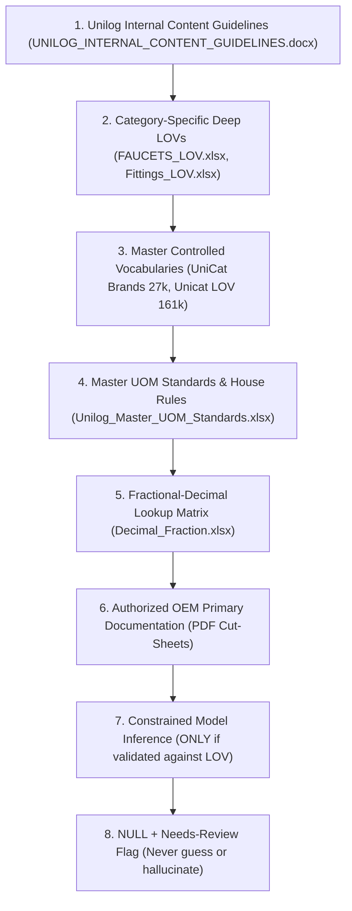
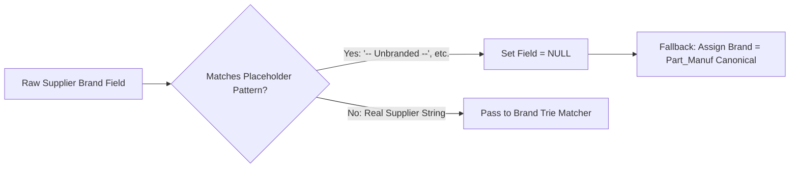
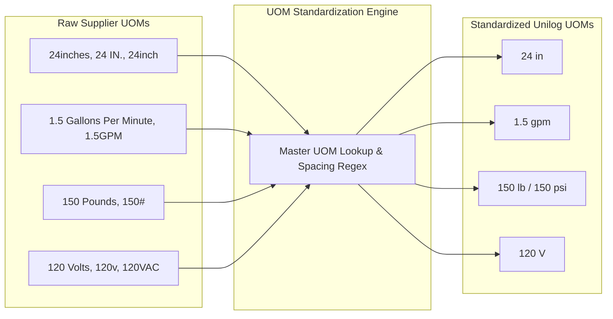
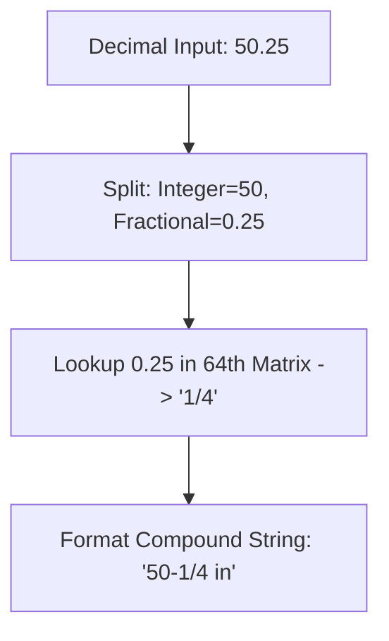
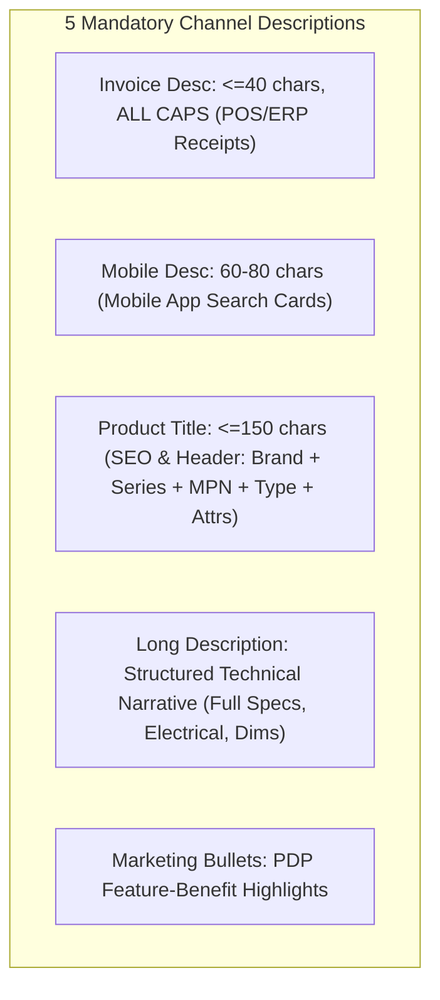

# Business Rules & Master Standards Engine (`Rules.md`)

**Project:** **PartForge** — AI-Powered Product Intelligence Pipeline for Industrial Commerce  
**Hackathon:** UniHack 2026 · Unilog × Hack2Skill  
**Companion Documents:** `PRD.md` · `Architecture.md` · `Design.md` · `AI_Strategy.md` · `Validation.md`  

---

## 1. Rule Philosophy & Precedence Hierarchy

> **"The output is constrained, not creative."** — Unilog Solution Guide

Every rule in this specification is implemented as a **deterministic validator function or table lookup**, never delegated to an unconstrained LLM prompt. When data sources conflict, PartForge resolves values according to this strict **Precedence Hierarchy**:



---

## 2. Placeholder Handling Rules (PH-Series)

Supplier feeds frequently populate brand and attribute columns with placeholder strings that indicate empty metadata.



| Rule ID | Rule Statement | Implementation Details |
| :--- | :--- | :--- |
| **PH-01** | **Placeholder Blacklist** | The following strings are strictly treated as `NULL`: `-- Unbranded --`, `-- No Unilog Brand --`, `-- No DIB Brand --`, `Unbranded`, `Generic`, `None`, `N/A`, `NA`, `TBD`, `Blank`. |
| **PH-02** | **Pre-Processing Execution** | Placeholder detection runs **before** any fuzzy matching, embedding lookup, or LLM prompt generation. Placeholders must never be passed downstream. |
| **PH-03** | **Pattern-Based Discovery** | Any string matching the regex `r"^--\s*.*\s*--$"` that is not explicitly in the known list is flagged as a candidate new placeholder and nullified. |
| **PH-04** | **Brand Fallback Rule** | When `E1_Brand`, `Unilog_Brand`, and `DIB_Brand` are all placeholders/null, the system assigns `BRAND_NAME = MANUFACTURER_NAME` (derived from `Part_Manuf`), per master guidelines. |

---

## 3. Manufacturer & Brand Normalization Rules (MB-Series)

Based on `UniCat_Manufacturer_and_Brand_List.xlsx` (27,000+ canonical entries):

| Rule ID | Rule Statement | Target Formatting & Examples |
| :--- | :--- | :--- |
| **MB-01** | **Canonical Entity Resolution** | Match supplier brand text against canonical `MANUFACTURER_NAME` and `BRAND_NAME` using SymSpell + Jaro-Winkler similarity (threshold $\ge 0.88$). |
| **MB-02** | **Legal Suffix Retention** | Retain legal corporate suffixes in `MANUFACTURER_NAME` (`Inc.`, `LLC`, `Corp.`, `Ltd.`, `Co.`). |
| **MB-03** | **Trademark Symbol Preservation** | Preserve official registered trademark symbols (`®`, `™`) in `BRAND_NAME`, `Product_Title`, and `Long_Desc`. Strip symbols in `INVOICE_DESC`. |
| **MB-04** | **Ambiguity & Margin Check** | If the top-2 fuzzy brand candidates have a similarity margin $<0.05$, flag the record for HITL review with `FLAG_BRAND_AMBIGUOUS`. |
| **MB-05** | **Zero Invented Brands** | Never invent a brand name. If unresolvable against the 27,000-row master list, output the raw sanitized string and flag for review. |

---

## 4. Master Unit of Measure (UOM) Standards (UOM-Series)

Based on `Unilog_Master_UOM_Standards_Abbreviations_and_Terms.xlsx` (89 measurement types, ~500 approved abbreviations, 22 house rules):



### 4.1 Mandatory Space Rule (UOM-01)
* **Rule**: A single space **MUST ALWAYS** separate the numeric quantity and the approved UOM abbreviation.
  - ✅ **Approved**: `24 in`, `120 V`, `15 A`, `47 dBA`, `1.5 gpm`, `150 psi`, `60 Hz`
  - ❌ **Forbidden**: `24in`, `24"`, `120V`, `15Amp`, `47dba`, `1.5GPM`, `150#`

### 4.2 Standard Industrial UOM Abbreviations Reference Table

| Measurement Category | Raw Supplier Variants | Approved Capture Form | Validated Example |
| :--- | :--- | :--- | :--- |
| **Length / Width / Depth** | `inch`, `inches`, `IN`, `IN.`, `"`, `in.` | `in` | `24 in W x 24-1/4 in D` |
| **Linear Feet** | `foot`, `feet`, `FT`, `FT.`, `'`, `ft.` | `ft` | `50 ft` |
| **Flow Rate** | `GPM`, `gpm`, `gal/min`, `Gallons Per Minute` | `gpm` | `1.5 gpm` |
| **Pressure Rating** | `PSI`, `psi`, `lb`, `lbs`, `#`, `Pounds` | `psi` / `lb` | `150 psi`, `150 lb` |
| **Sound Level** | `db`, `DB`, `dBA`, `dba`, `Decibels` | `dBA` | `47 dBA` |
| **Voltage Rating** | `volt`, `volts`, `V`, `v`, `VAC`, `VDC` | `V` | `120 V` |
| **Amperage Rating** | `amp`, `amps`, `A`, `a`, `Amperes` | `A` | `15 A` |
| **Frequency** | `hz`, `HZ`, `Hertz` | `Hz` | `60 Hz` |
| **Temperature** | `deg F`, `F`, `Fahrenheit`, `deg C`, `C` | `deg F` / `deg C` | `140 deg F` |
| **Energy Consumption** | `kwh`, `KWH`, `kW-hr`, `Kilowatt Hours` | `kW-hr` | `240 kW-hr` |

---

## 5. Fractional-Decimal Resolution Engine (FRAC-Series)

Based on `Decimal_Fraction.xlsx` (63 exact inch fraction $\leftrightarrow$ decimal pairs from $1/64$ to $63/64$):



| Rule ID | Rule Statement | Implementation Details |
| :--- | :--- | :--- |
| **FRAC-01** | **64th Matrix Lookup** | All decimal inch values must convert to exact fractions using the 64th table (`0.015625` $\rightarrow$ `1/64`, `0.0625` $\rightarrow$ `1/16`, `0.25` $\rightarrow$ `1/4`, `0.375` $\rightarrow$ `3/8`, `0.5` $\rightarrow$ `1/2`, `0.75` $\rightarrow$ `3/4`). |
| **FRAC-02** | **Compound Integer-Fraction Hyphenation** | If an integer precedes a fraction, join with a hyphen, followed by a space and unit: `50.25 in` $\rightarrow$ `50-1/4 in`; `24.75 in` $\rightarrow$ `24-3/4 in`. |
| **FRAC-03** | **Pure Fraction Sizing** | If the value is $<1.0$, do not prefix with a zero or hyphen: `0.375 in` $\rightarrow$ `3/8 in`; `0.5 in` $\rightarrow$ `1/2 in`. |
| **FRAC-04** | **Multi-Dimensional Format** | Multi-dimensional measurements must format as `[W] in W x [D] in D x [H] in H` (e.g. `24 in W x 24-1/4 in D`). |

---

## 6. Multi-Channel Description Construction Formulas (DESC-Series)



### 6.1 Invoice Description (DESC-01)
* **Constraints**: Strictly $\le 40$ characters, **ALL UPPERCASE (ALL CAPS)**, minimal punctuation.
* **Formula**:
  ```
  Invoice_Desc = ITEM_TYPE_ABBR + " " + KEY_ATTR_1 + " " + DIMENSION + UOM
  ```
* **Example**: `PDSH4816AF Dishwasher SS` → `DISHWASHER LEG 5 SST 120V 15A 50-1/4IN` (38 chars ≤ 40).

### 6.2 Mobile Description (DESC-02)
* **Constraints**: Strictly between 60 and 80 characters, Title Case.
* **Formula**:
  ```
  Mobile_Desc = MANUFACTURER_NAME + " " + BRAND_NAME + ", " + ITEM_TYPE + ", " + SERIES + ", " + MPN
  ```
* **Example**: `Rheem Manufacturing FRIGIDAIRE, Dishwasher, Professional Series, PDSH4816AF` (74 chars ∈ [60, 80]).

### 6.3 Product Title / Short Description (DESC-03)
* **Constraints**: Strictly $\le 150$ characters, Title Case, registered trademark symbols (`®`, `™`) preserved.
* **Formula**:
  ```
  Product_Title = BRAND®/™ + " " + [SERIES] + " " + MPN + " " + ITEM_TYPE + " With " + [FEATURE™] + ", " + [KEY_ATTRS]
  ```
* **Example**: `FRIGIDAIRE® Professional Series PDSH4816AF Dishwasher With CleanBoost™, Leg Mounting, 5-Wash Cycle, Stainless Steel`

### 6.4 Long Description (DESC-04)
* **Constraints**: Structured technical narrative detailing Brand, Series, Features, Electrical Specs, Mounting, Dimensions with fractions, Sound Level, and Materials.
* **Formula**:
  ```
  Long_Desc = BRAND®/™ + " " + ITEM_TYPE + " With " + FEATURE™ + ", " + SERIES + ", " + SPEC_LIST(Cycles, V, A, Mounting, Dims, Depth, dBA, Material)
  ```
* **Example**: `FRIGIDAIRE® Dishwasher With CleanBoost™, Professional Series, 5 Wash Cycles, 120 V, 15 A, Leg Mounting, 24 in W x 24-1/4 in D, 50-1/4 in Depth With Door Open, 47 dBA Sound Level, Stainless Steel`

---

## 7. Deep Category-Specific LOV Rules

### 7.1 Kitchen & Bath Sink Faucets (`FAUCETS_LOV.xlsx`)
* **Classpath**: `Plumbing > Faucets > Kitchen Faucets` / `Bath Sink Faucets` | **UNSPSC**: `30181702`
* **Mandatory Title Build Order**:
  $$\text{Brand} + \text{ Series} + \text{ MPN} + \text{ Faucet Type} + \text{ Flow Rate (gpm)} + \text{ Number of Holes} + \text{ Finish/Color}$$
* **Controlled Vocabulary Constraints**:
  - `Mounting Type`: `Deck Mount`, `Wall Mount`, `Single Hole`, `Centerset`, `Widespread`
  - `Flow Rate`: Strictly formatted as `X.X gpm` (e.g. `1.5 gpm`, `1.8 gpm`, `2.2 gpm`)
  - `Valve Core Type`: `Ceramic Disc`, `Ball Valve`, `Cartridge`
  - `Finish`: `Chrome`, `Brushed Nickel`, `Matte Black`, `Oil Rubbed Bronze`, `Stainless Steel`
  - `ADA Compliance`: `Yes`, `No`

### 7.2 Pipe, Tube & Hose Fittings (`Fittings_LOV.xlsx`)
* **390 Approved Fitting Types**: e.g., `Coupling`, `Elbow 90 Deg`, `Elbow 45 Deg`, `Tee`, `Union`, `Adapter`, `Bushing`, `Nipple`, `Cap`, `Plug`.
* **Connection Type Mapping (1,472 variants $\rightarrow$ 515 canonical)**:
  - `MIP x FIP`, `NPT x NPT`, `Push-to-Connect x Push-to-Connect`, `Compression x Compression`, `Barbed x NPT`.
* **Material Normalization (464 variants $\rightarrow$ 113 canonical)**:
  - `BRS`, `Brass Alloy`, `Cast Brass`, `Forged Brass` $\rightarrow$ `Brass`
  - `SST`, `304 SS`, `316 Stainless Steel`, `Stainless` $\rightarrow$ `Stainless Steel`
  - `PVC`, `Polyvinyl Chloride`, `Sch 40 PVC` $\rightarrow$ `PVC`
  - `DI`, `Ductile Iron`, `Class 150 DI` $\rightarrow$ `Ductile Iron`

---

## 8. Sourcing Hierarchy & Allowlist Rules (SRC-Series)

| Rule ID | Sourcing Rule Statement |
| :--- | :--- |
| **SRC-01** | **OEM Primary Source Hierarchy**: Technical facts must originate from manufacturer-owned domains (`*.frigidaire.com`, `*.moen.com`, `*.parker.com`) or official PDF cut-sheets. |
| **SRC-02** | **Marketplace Blacklist**: Consumer marketplaces (`amazon.com`, `ebay.com`, `aliexpress.com`, `walmart.com`) and unverified scraping aggregators are strictly prohibited and network-blocked. |
| **SRC-03** | **Distributor Fallback Tier**: National distributor sites (Grainger, Ferguson) may only be queried for cross-referencing when OEM documentation is unavailable, and must trigger a `sourcing_tier = "distributor_fallback"` warning chip. |
| **SRC-04** | **Lineage Attachment**: Every extracted attribute value must store its provenance metadata (`source_url`, `page_number`, `bounding_box`, `extraction_timestamp`). |
