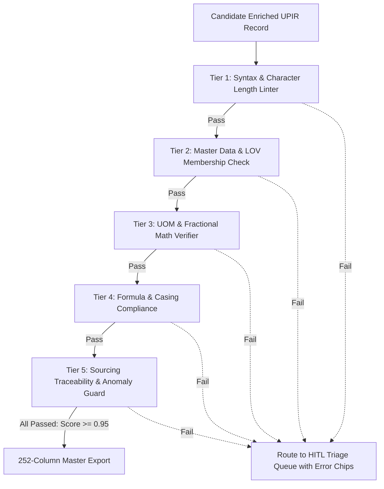
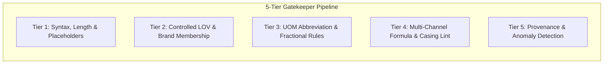
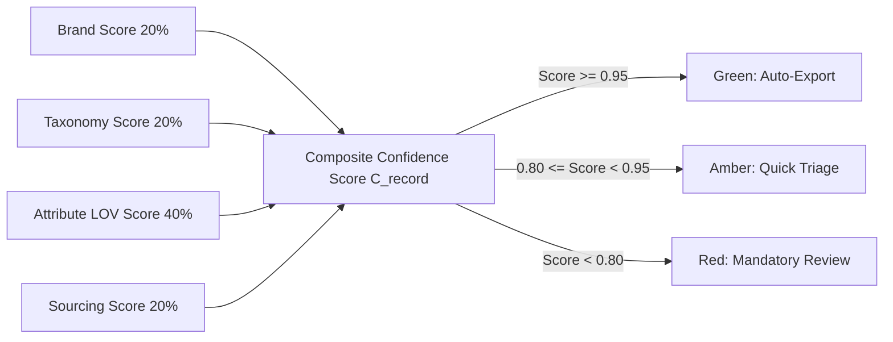

# Deterministic Validation & Gatekeeper Engine (`Validation.md`)

**Project:** **PartForge** — AI-Powered Product Intelligence Pipeline for Industrial Commerce  
**Hackathon:** UniHack 2026 · Unilog × Hack2Skill  
**Companion Documents:** `PRD.md` · `Architecture.md` · `Rules.md` · `Design.md` · `Evaluation.md`  

---

## 1. Multi-Tiered Gatekeeper Architecture

In industrial commerce, an unverified specification can cause equipment failure, physical damage, or costly returns. PartForge operates an automated **5-Tier Quality Gatekeeper Firewall**. Every candidate product record generated by the AI reasoning plane must pass through all 5 tiers before clearance for delivery export.



---

## 2. Gatekeeper Tier Specifications



### 2.1 Tier 1: Syntax, Character Limits & Placeholder Validation
* **Rule 1.1 (Placeholder Leaks)**: Reject any field containing `-- Unbranded --`, `-- No Unilog Brand --`, `None`, `N/A`, `Generic`.
  ```
  Assert: Invoice_Desc does NOT contain any placeholder string
  ```
* **Rule 1.2 (Invoice Character Ceiling)**: Assert `len(Invoice_Desc) ≤ 40`.
* **Rule 1.3 (Mobile Character Window)**: Assert `60 ≤ len(Mobile_Desc) ≤ 80`.
* **Rule 1.4 (Title Length Ceiling)**: Assert `len(Product_Title) ≤ 150`.
* **Rule 1.5 (UNSPSC Format)**: Assert UNSPSC is exactly 8 numeric digits.

### 2.2 Tier 2: Master Data & Controlled LOV Membership
* **Rule 2.1 (Brand Validation)**: Assert `BRAND_NAME ∈ UniCat_Manufacturer_and_Brand_List`.
* **Rule 2.2 (Manufacturer Validation)**: Assert `MANUFACTURER_NAME ∈ UniCat_Manufacturer_and_Brand_List`.
* **Rule 2.3 (Discrete Attribute LOV Compliance)**: For all categorical attributes, assert:
  ```
  Attribute_Value ∈ LOV_Allowed_Values(Classpath, Attribute_Label)
  ```
* **Rule 2.4 (Fitting Connection Type)**: Assert connection string ∈ 515 canonical connection types (`Fittings_LOV.xlsx`).
* **Rule 2.5 (Fitting Material)**: Assert material string ∈ 113 canonical material types (`Fittings_LOV.xlsx`).

### 2.3 Tier 3: UOM Standards & Fractional Math Verification
* **Rule 3.1 (Approved UOM Abbreviation)**: All extracted physical quantities must end with an approved UOM abbreviation from `Unilog_Master_UOM_Standards_Abbreviations_and_Terms.xlsx` (e.g. `in`, `ft`, `gpm`, `psi`, `V`, `A`, `dBA`).
* **Rule 3.2 (Mandatory UOM Spacing)**: Assert pattern `r"^\d+(\.\d+)?(-(\d+\/\d+))?\s[a-zA-Z]+$"` (e.g. `24 in`, not `24in`).
* **Rule 3.3 (Exact Fractional Conversion)**: All inch measurements with decimals must resolve to the 64th fractional matrix (`Decimal_Fraction.xlsx`). Compound format must be hyphenated: `50-1/4 in`.

### 2.4 Tier 4: Multi-Channel Formula & Casing Lint
* **Rule 4.1 (Invoice Casing)**: Assert `Invoice_Desc == Invoice_Desc.upper()`.
* **Rule 4.2 (Trademark Symbol Placement)**: Assert registered marks (`®`, `™`) are retained in `Product_Title`, `Long_Desc`, and `Brand_Name`, but stripped from `Invoice_Desc`.
* **Rule 4.3 (Formula Adherence)**: Assert `Product_Title` starts with `Brand` and contains `MPN` and `Item Type`.

### 2.5 Tier 5: Sourcing Provenance & Physical Anomaly Detection
* **Rule 5.1 (Sourcing Lineage Required)**: Every non-null attribute must have a verified `ProvenanceRecord` (URL, PDF snippet, or master lookup key).
* **Rule 5.2 (Physical Outlier Detection)**: Flag anomalous values:
  - Faucet Flow Rate $> 5.0\text{ gpm}$ (unrealistic for residential/commercial sinks).
  - Dishwasher Sound Level $< 30\text{ dBA}$ or $> 70\text{ dBA}$.
  - Electrical Voltage $\notin \{12\text{ V}, 24\text{ V}, 120\text{ V}, 208\text{ V}, 240\text{ V}, 277\text{ V}, 480\text{ V}\}$.

---

## 3. Mathematical Confidence Calibration Formula

Each enriched record is assigned a composite **Confidence Score** $C_{\text{record}} \in [0.0, 1.0]$ computed across 4 weighted dimensions:

$$C_{\text{record}} = w_1 \cdot C_{\text{brand}} + w_2 \cdot C_{\text{taxonomy}} + w_3 \cdot C_{\text{attributes}} + w_4 \cdot C_{\text{provenance}}$$

Where:
* $w_1 = 0.20$ (Brand Match Exactness)
* $w_2 = 0.20$ (Taxonomy Classification Confidence)
* $w_3 = 0.40$ (Attribute LOV Conformity & Extraction Quality)
* $w_4 = 0.20$ (Sourcing Traceability & Evidence Strength)

  ```
  Attribute_Score = (1/N) × Σ [ I(Value_i ∈ LOV) × 0.6 + LLM_LogProb_i × 0.4 ]
  ```



---

## 4. Automated Error Codes & Auto-Repair Strategies

| Error Code | Severity | Violation Description | Automated Repair Action |
| :--- | :--- | :--- | :--- |
| `ERR_CHAR_INVOICE_LEN` | High | `Invoice_Desc` exceeds 40 characters. | Applies standardized abbreviation dictionary (`DISHWASHER` $\rightarrow$ `DISHW`, `STAINLESS STEEL` $\rightarrow$ `SST`). |
| `ERR_CASING_INVOICE` | Medium | `Invoice_Desc` contains lowercase characters. | Executes `.upper()` transformation. |
| `ERR_UOM_NO_SPACE` | High | Missing space between number and unit (`24in`). | Regex insert space: `re.sub(r'(\d)([a-zA-Z])', r'\1 \2', text)`. |
| `ERR_LOV_OUT_OF_VOCAB` | High | Extracted value not found in `Unicat_Lov_v1_0`. | RapidFuzz fuzzy match with threshold $\ge 88$; if $<88$, flag for HITL. |
| `ERR_DECIMAL_NOT_FRACTION` | Medium | Dimension written as decimal (`50.25 in`). | Lookup decimal fraction matrix $\rightarrow$ `50-1/4 in`. |
| `ERR_UNTRUSTED_SOURCE` | Critical | Value sourced from blacklisted marketplace. | Re-route to OEM search agent or flag cell for manual review. |
