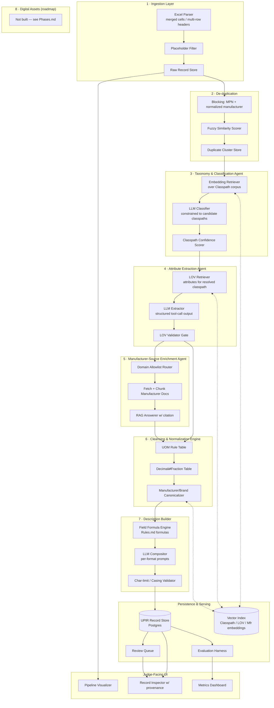
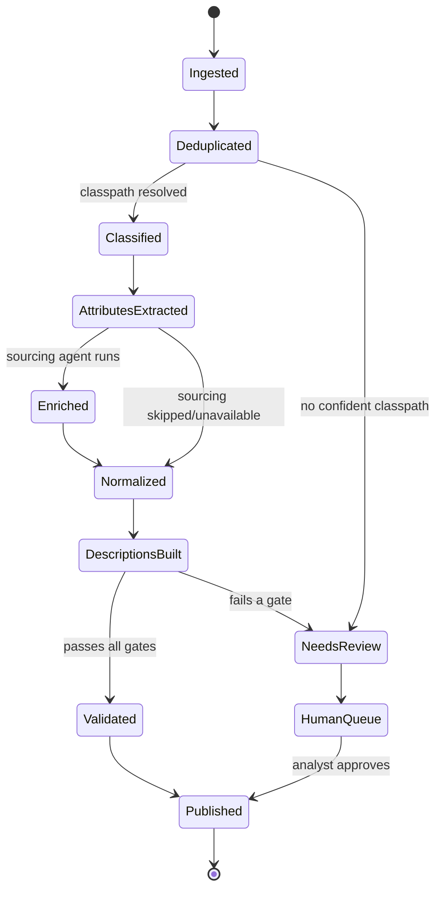
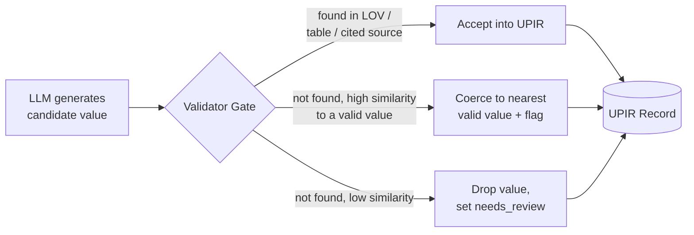
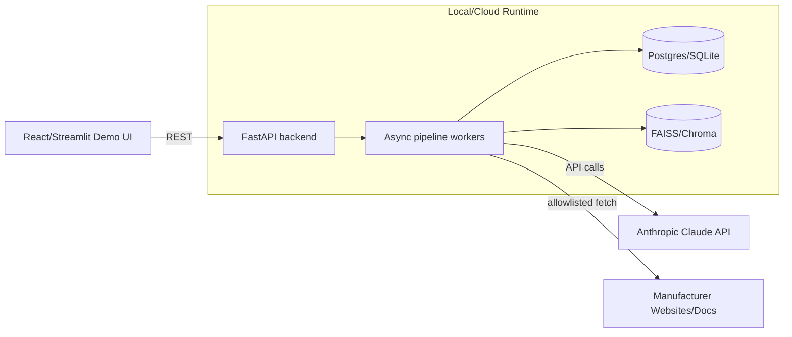

# Architecture.md — System Architecture

**Project:** PartForge — AI-Powered Product Intelligence Pipeline
**Companion docs:** `PRD.md` (requirements) · `Rules.md` (business rules) · `Design.md` (schemas & UX) · `AI_Strategy.md` (model layer)

---

## 1. Architectural Principles

1. **Deterministic where the answer is known, generative where it isn't.** UOM conversion, fraction lookup, and manufacturer/brand canonicalization are table lookups — they run in a rules engine, not an LLM prompt. Classification, attribute extraction from free text, and description writing are genuinely generative — they run through the LLM layer, constrained and validated.
2. **Grounding is a first-class citizen, not a prompt instruction.** Every generative step is followed by a deterministic **validation gate** that checks the output against the controlled vocabulary/master data before it is allowed to become part of a record. See §6 and `Validation.md`.
3. **Every field carries its own provenance.** No field is just a value — it's a `(value, source, confidence)` triple. This is what makes the "needs review" flag credible instead of cosmetic.
4. **Stateless, replayable stages.** Each pipeline stage reads a record in one state and writes it in the next; the whole pipeline for one item is replayable from any stage, which is what makes the evaluation harness and debugging tractable in a 36-hour build.
5. **Batch-first, not click-first.** The pipeline is designed to run unattended over 1,000 rows and produce a report, with the UI as a window into that run — not a rebuild for a demo.

---

## 2. High-Level Component Diagram



---

## 3. Orchestration Model

PartForge runs each record through the pipeline as an explicit **state machine**, implemented as a directed graph (LangGraph-style) rather than a monolithic script, so that:

- Any stage can be re-run in isolation against the 200-item ground truth for scoring.
- Failures at one stage (e.g., no classpath match) route to a **degraded path** (flag + partial record) instead of crashing the batch.
- The `agent_trace` for a record is simply the path taken through the graph, plus each node's inputs/outputs — this *is* the audit log, not a separate logging concern.



---

## 4. Agent Responsibilities

| Agent / Component | Type | Responsibility | Reads | Writes |
|---|---|---|---|---|
| Excel Ingestion Parser | Deterministic | Parse `.xlsx` sheets safely (merged cells, multi-row headers, side-by-side blocks); emit a parse report | Raw `.xlsx` files | Raw record rows + parse report |
| Placeholder Filter | Deterministic | Null out `-- Unbranded --` and equivalents before they reach any matcher | Raw record | Cleaned raw record |
| De-dup Scorer | Deterministic + fuzzy string match | Cluster likely-duplicate rows on MPN + normalized manufacturer | Cleaned records | Duplicate cluster IDs |
| Classification Agent | LLM + retrieval | Propose top-k classpaths from the LOV classpath corpus, pick one with confidence | `Part_Desc`, MPN, LOV classpaths | `classpath`, `dept/class/fine`, `classification_confidence` |
| Attribute Extraction Agent | LLM + tool-calling | Extract attribute label/value pairs constrained to the resolved classpath's LOV | `Part_Desc`, classpath's LOV rows | `attributes[]` (raw candidates, pre-validation) |
| LOV Validator Gate | Deterministic | Accept, coerce, or reject each candidate attribute value against Normalized Values | `attributes[]` candidates, LOV table | `attributes[]` (validated) + rejected list |
| Manufacturer-Source Enrichment Agent | LLM + RAG + allowlisted fetch | Fill gaps (e.g., missing dimensions) from manufacturer-owned sources only, with citations | classpath, MPN, brand, allowlist | `attributes[]` additions with `source_url` |
| Normalization Engine | Deterministic rules | UOM standardization, decimal↔fraction conversion, manufacturer/brand canonicalization | Master UOM table, Decimal_Fraction table, Manufacturer/Brand list | Normalized fields |
| Description Builder | Rule engine + LLM compositor | Assemble the 5 description formats per the Content Guidelines' formulas | Normalized record, `Rules.md` formulas | `invoice_desc`, `mobile_desc`, `product_title`, `long_description`, `marketing_desc` |
| Validation Gate (final) | Deterministic | Character-limit, casing, and LOV-compliance checks before publish | Full UPIR record | `validation_flags[]`, `needs_review` |
| Evaluation Harness | Deterministic + embedding similarity | Score a run against the 200-item ground truth | UPIR records, ground truth | Metrics report (`Evaluation.md`) |

---

## 5. Data Layer

### 5.1 Storage design

| Store | Technology (hackathon) | Technology (production path) | Purpose |
|---|---|---|---|
| UPIR record store | PostgreSQL (or SQLite for local demo) | PostgreSQL, partitioned by category | Canonical enriched records, one row per SKU, JSONB for `attributes[]` and `agent_trace[]` |
| Vector index | FAISS / Chroma, in-process | pgvector or managed vector DB | Embeddings of classpath descriptions, LOV attribute values, and manufacturer names for fuzzy retrieval |
| Master/reference tables | Loaded from source `.xlsx` into normalized SQL tables at startup | Same, refreshed on a schedule | UOM table, Decimal_Fraction table, Manufacturer/Brand table, LOV table |
| Review queue | A filtered view (`needs_review = true`) over the record store | Same, with assignment/workflow columns | Human-in-the-loop backlog |
| Run/metrics store | Flat JSON/CSV per run | Time-series table | Evaluation harness output, for trend tracking across runs |

### 5.2 Reference-data ingestion (why this matters architecturally)

The reference files are **not files, they are a database** the moment the pipeline starts — this is the single most important architectural decision in the project. On boot, PartForge loads:

1. `Unilog_Master_UOM_Standards_Abbreviations_and_Terms.xlsx` → `uom_rules` table (keyed by raw variant → approved abbreviation + measurement type)
2. `Decimal_Fraction.xlsx` → `decimal_fraction` table (the 4-block layout is flattened into one 63-row `fraction ↔ decimal` table at load time — see `Rules.md` §3.2 for the parsing note)
3. `UniCat_Manufacturer_and_Brand_List.xlsx` → `manufacturer_brand` table, indexed for both exact-match and fuzzy (trigram/embedding) lookup
4. `Unicat_Lov_v1_0_Updated_With_Remarks.xlsx` → `lov` table, indexed by `classpath` and `attribute_label`, with `Normalized Values` as the accepted set
5. `FAUCETS_LOV.xlsx`, `Fittings_LOV.xlsx` → category-specific override tables that take precedence over the general LOV for their classpaths (attribute *sequence*, filtering flags, and description build order are category-specific and must win over the general table)

This "reference data as database, loaded once, queried many times" pattern is what lets classification, extraction, and normalization all be **retrieval-augmented lookups against ground truth**, not the LLM's memorized guess.

### 5.3 The UPIR schema (summary — full field list in `Design.md`)

```json
{
  "sku": "string",
  "mfg_part_num": "string",
  "manufacturer": { "raw": "string", "canonical": "string", "code": "string", "confidence": 0.0 },
  "brand": { "canonical": "string", "code": "string" },
  "classification": { "dept": "string", "class": "string", "fine": "string", "classpath": "string", "unspsc": "string|null", "confidence": 0.0 },
  "attributes": [ { "label": "string", "value": "string", "normalized_value": "string", "lov_matched": true, "source": "input|lov|manufacturer_source|inferred", "source_url": "string|null", "confidence": 0.0 } ],
  "descriptions": { "invoice_desc": "string", "mobile_desc": "string", "product_title": "string", "long_description": "string", "marketing_desc": "string" },
  "digital_assets": { "status": "not_built" },
  "confidence_score": 0.0,
  "needs_review": false,
  "review_reasons": ["string"],
  "agent_trace": [ { "stage": "string", "input_hash": "string", "output_summary": "string", "duration_ms": 0 } ],
  "pipeline_version": "string"
}
```

---

## 6. Grounding & Validation Architecture

This is the architectural answer to the brief's central warning: *"A fluent description made of invented values scores zero."*



Every generative agent output passes through this gate before touching the record store. This means the LLM is architecturally **not the source of truth** — it's a proposer. The tables loaded in §5.2 are the source of truth. Full test coverage of this gate is described in `Validation.md`.

---

## 7. Scalability Path

| Concern | Hackathon build | Path to catalog scale |
|---|---|---|
| Throughput | Async batch runner, single process, ~1,000 items | Horizontally-scaled stateless workers per stage, queue-based (e.g., Celery/Redis or a managed workflow engine) |
| Vector search | In-process FAISS/Chroma | Managed vector DB (pgvector, or a hosted vector store) sized for full LOV (161K rows) and manufacturer list (27K rows) |
| LLM cost | Single-model calls per stage, no caching | Response caching for repeated MPN/description patterns; cheaper model for classification retrieval re-ranking, stronger model reserved for final description composition (see `AI_Strategy.md` §4) |
| Manufacturer-source enrichment | Bounded, allowlisted demo sample | Scheduled crawler respecting robots.txt and the sourcing hierarchy, with a per-domain rate limiter and a source-freshness policy |
| Review queue | In-memory/DB filter | Full workflow states (assigned, in-review, approved, rejected) with SLA tracking |
| Observability | `agent_trace` per record, run-level JSON report | Structured logging + metrics pipeline (e.g., OpenTelemetry) feeding the same dashboard shown in the demo |

---

## 8. Failure Modes & Degradation Strategy

| Failure | System behavior |
|---|---|
| No confident classpath match | Record enters `NeedsReview` with `review_reasons: ["no_confident_classpath"]`; downstream attribute extraction is skipped rather than guessed |
| Attribute value not found in LOV, no close match | Value dropped from `attributes[]`, logged in `review_reasons`, never silently written |
| Manufacturer string doesn't resolve above threshold | `manufacturer.canonical` left `null`, `needs_review = true` — never a fuzzy best-guess written as fact |
| Manufacturer-source fetch fails or hits a disallowed domain | Enrichment step is skipped for that field; field remains as extracted from input only, no fabricated fill-in |
| Character-limit validator fails post-generation | Description regenerated once with the violation fed back to the compositor prompt; if it fails twice, field is flagged, not silently truncated |

---

## 9. Deployment View (Hackathon Demo)



A single `run_pipeline.py` entrypoint can process the 200-item or 1,000-item file end-to-end from the command line for judge reproducibility, independent of the UI.

---

**Related documents:** `PRD.md` · `Rules.md` · `Design.md` · `AI_Strategy.md` · `Validation.md`
