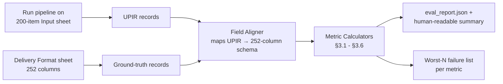

# Evaluation.md — Evaluation Methodology & Metrics

**Project:** PartForge · **Purpose:** define exactly how we score the pipeline against Unilog's own ground truth, so every number we present to judges is reproducible from one command, not a slide-deck claim.

> "Field-level accuracy against the 200 known-good rows, character-limit compliance, and percentage of values found in the LOV are all simple, credible metrics. Judges will look for them." — Solution Guide §4

This document is our direct response to that instruction.

---

## 1. Evaluation Principles

1. **The 200-item Delivery Format sheet is the only ground truth.** We do not hand-tune outputs to look good; we score against it as-is, including its documented imperfections (§7).
2. **Every metric has a denominator shown alongside it**, so "94%" is never presented without "376 / 400."
3. **Metrics are computed by one reproducible script**, `eval/run_eval.py`, runnable independently of the UI — a judge (or ourselves, at 2am) can re-run it and get the same numbers.
4. **We report failure, not just success.** The evaluation report always includes a ranked list of the worst-performing fields/categories, not just an aggregate score.
5. **Coverage and accuracy are reported separately.** A field we didn't attempt is not the same as a field we got wrong — conflating them would inflate or deflate the picture dishonestly.

---

## 2. Test Sets

| Set | Size | Role |
|---|---|---|
| **Ground truth set** | 200 items (`Unilog-Sample_200_Items-Input-vs-Output.xlsx`) | Primary scoring set — Input sheet fed to the pipeline, Delivery Format sheet is the answer key |
| **Volume set** | 1,000 items (`Sample-1000_Items.xlsx`) | No answer key — scored on internal consistency metrics only (LOV compliance, char-limit compliance, coverage, confidence distribution), not accuracy |
| **Deep-dive subset** | The ground-truth items whose classpath falls under Faucets or Fittings | Scored on the full metric set below, since these are the categories with complete attribute-level specs |

---

## 3. Metric Definitions

### 3.1 Classification accuracy

| Metric | Definition |
|---|---|
| **Classpath exact-match accuracy** | `# records where predicted Dept>Class>Fine == ground-truth Dept>Class>Fine` / `# records with a non-blank ground-truth classpath` |
| **Top-3 accuracy** | `# records where ground-truth classpath ∈ {predicted top-3 candidates}` / total — reported because the UI surfaces top-3 for low-confidence cases (`Design.md` §4.3), so near-misses still have recovery value |
| **UNSPSC match rate** | Computed only over ground-truth rows with a non-blank UNSPSC cell, per Rules.md CL-4 |

### 3.2 Attribute extraction accuracy

| Metric | Definition |
|---|---|
| **Attribute-value exact match** | Per attribute label present in ground truth, `# records where our normalized_value == ground truth value` / `# records where ground truth has that attribute populated` |
| **LOV-compliance rate** | `# extracted attribute values found in the LOV's Normalized Values for that classpath` / `# total extracted attribute values` — this is a coverage-of-vocabulary metric, independent of whether it also matches ground truth, and is the single metric the brief calls out by name |
| **Attribute recall** | `# ground-truth attributes we populated (regardless of correctness)` / `# ground-truth attributes present` — tells us what we're missing, separate from what we got wrong |
| **Attribute precision** | `# attributes we generated that are actually valid for the classpath` / `# attributes we generated` — tells us if we're inventing attributes that don't belong |

### 3.3 Normalization correctness

| Metric | Definition |
|---|---|
| **UOM correctness** | `# unit tokens in output matching an approved abbreviation in Master UOM Sheet 1, correctly spaced (Rules.md UOM-2)` / `# unit tokens in output` |
| **Fraction conversion correctness** | `# decimal-inch values correctly converted per the 63-row Decimal_Fraction table` / `# decimal-inch values encountered` |
| **Manufacturer canonicalization exact-match rate** | `# manufacturer.canonical values exactly matching the 27K-row master list's casing/suffix/symbols` / `# records with a resolvable manufacturer.canonical` |
| **Brand canonicalization exact-match rate** | Same, for `brand.canonical`, including the "manufacturer substituted for missing brand" case (Rules.md MB-5) scored as correct when ground truth does the same |

### 3.4 Description quality

| Metric | Definition |
|---|---|
| **Character-limit compliance rate** | Per format (Invoice ≤40, Mobile 60–80, Title/Long per category cap): `# generated descriptions within spec` / `# generated descriptions` |
| **Casing compliance rate** | E.g., `# Invoice descriptions that are fully ALL CAPS` / total Invoice descriptions generated |
| **Formula compliance rate** | Manual + automated check: does the field contain, in the right order, the components the formula specifies (e.g., Title = Brand + Series + MPN + Item Type + key attributes)? Scored via a structured field-presence check, not string equality, since exact phrasing may legitimately vary |
| **Semantic similarity to ground truth** | Embedding cosine similarity between our generated field and the ground-truth field, reported as a secondary signal alongside exact/formula match — because two differently-phrased but equally correct descriptions shouldn't be scored as wrong |

### 3.5 Trust & safety metrics

| Metric | Definition |
|---|---|
| **Hallucination rate** | `# output fields with no traceable source (not input, not LOV, not a cited manufacturer URL)` / `# total output fields` — target is as close to 0% as the pipeline design allows, by construction (`Architecture.md` §6) |
| **Review-flag precision** | Of records flagged `needs_review`, `# that a manual audit confirms genuinely had an unresolved issue` / `# flagged` — a low precision means we're over-flagging (annoying but safe); a low **recall** (not flagging real problems) is the metric we care about avoiding most |
| **Review-flag recall** | Of records with a real, manually-identified issue, `# that were flagged` / `# with a real issue` — sampled via manual audit of a stratified subset |

### 3.6 Scale metrics (1,000-item set)

| Metric | Definition |
|---|---|
| **Coverage rate** | `# of 1,000 items assigned a non-null classpath` / 1,000 |
| **Throughput** | Items processed per minute, end-to-end |
| **Cost per record** | LLM API spend / items processed (see `AI_Strategy.md` §6 for budget) |
| **Confidence distribution** | Histogram of `confidence_score` across the 1,000-item run — used to sanity-check that confidence isn't degenerate (e.g., everything scored 0.9) |

---

## 4. Scoring Methodology

1. **Field Aligner:** maps our internal UPIR schema (`Design.md` §2) to the 252-column Delivery Format schema, field by field, documented in `eval/field_mapping.yaml` so the mapping itself is auditable.
2. **Known-gap handling (§7):** before scoring, any ground-truth cell that is itself blank (documented blank UNSPSC/country-of-origin cells) is excluded from that field's denominator rather than counted as a miss.
3. **Stratified reporting:** every metric is reported (a) overall, (b) split by Faucets vs. Fittings vs. other categories, and (c) split by the 200-item set vs. the 1,000-item set where applicable.
4. **Manual audit sample:** a stratified random sample of 20 records (10 flagged, 10 not flagged) is manually reviewed each build cycle to compute review-flag precision/recall (§3.5), since these can't be fully automated against a ground truth that doesn't label "should have been flagged."

---

## 5. Target Thresholds

These are the internal bars the team builds against — presented to judges as goals-vs-actuals, not just actuals, to show intentional rigor:

| Metric | Target |
|---|---|
| Classpath exact-match accuracy (Faucets + Fittings) | ≥ 85% |
| LOV-compliance rate | ≥ 95% |
| Character-limit compliance rate (all formats) | 100% (this is a hard validator gate, not a soft target — Rules.md DESC-2) |
| Manufacturer canonicalization exact-match rate | ≥ 90% of resolvable records |
| Hallucination rate | As close to 0% as architecturally possible (target < 2%, ideally driven only by edge cases in the validator gate, not systemic leakage) |
| Review-flag recall | ≥ 90% on the manual audit sample |
| 1,000-item coverage rate | ≥ 80% assigned a classpath, honestly reported for the rest |

---

## 6. Reporting Format

The evaluation harness outputs:

1. `eval_report.json` — machine-readable, feeds the Metrics Dashboard (`Design.md` §4.6) directly, no manual number entry
2. `eval_summary.md` — a human-readable digest, auto-generated, safe to paste directly into the pitch deck
3. `failures/` — a directory of the worst-N records per metric, each with input, output, ground truth, and the specific mismatch highlighted — this is what we open live if a judge asks "show me where it's wrong," which is a stronger answer than only showing where it's right

---

## 7. Known Ground-Truth Gaps (handled explicitly, not silently)

Per the Solution Guide's own note: *"The delivery file has blank UNSPSC and country-of-origin cells, and at least one row where the manufacturer and brand look mismatched."*

| Gap | How the harness handles it |
|---|---|
| Blank UNSPSC cells | Excluded from the UNSPSC match-rate denominator (Rules.md CL-4) |
| Blank country-of-origin cells | Excluded from any country-of-origin metric denominator |
| The known manufacturer/brand mismatch row | Flagged in the harness output as a "ground-truth artifact" — our score on this row is reported separately, and we explicitly show that our own pipeline does **not introduce new mismatches** (Rules.md MB-4/MB-6) elsewhere in the set, which is the actually meaningful claim |

Reporting these explicitly, rather than silently excluding them without comment, is itself a scored design choice — the brief states this directly: *"Real data is imperfect — say so... Noticing and reporting such gaps is a strength, not a failure."*

---

**Related documents:** `PRD.md` · `Rules.md` · `Design.md` · `Validation.md` · `Demo.md`
