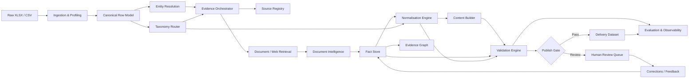

# UniHack — Architecture

## 1. Architecture Intent

The architecture is deliberately **hybrid**: deterministic where correctness is decidable, retrieval-grounded where external evidence is required, and agentic only where judgement or multi-step reasoning adds measurable value.

The central design rule is:

> **Never let free-form generation bypass the product data model or validation engine.**

This architecture is tailored to the organiser's reference pack: a 200-item labelled ground truth, a 1,000-item scale dataset, a master content guideline, UOM/term standards, manufacturer/brand master data, and large LOVs plus category-specific specifications. citeturn154558view1

---

## 2. Logical Architecture



---

## 3. Layered Design

### Layer 1 — Data plane

Responsibilities:

- ingest XLSX;
- parse irregular worksheets;
- normalise raw columns;
- maintain row identity;
- write intermediate JSON/Parquet/SQLite records.

Recommended hackathon implementation:

- Python;
- `pandas`/`openpyxl` for workbook parsing;
- SQLite or DuckDB for reproducible local state.

### Layer 2 — Knowledge plane

Contains organiser reference knowledge:

```text
reference/
  content_guidelines/
  uom/
  decimal_fraction/
  manufacturer_brand/
  lov/
  category_specs/
  source_registry/
```

Each source is versioned and loaded into a queryable representation.

### Layer 3 — AI reasoning plane

Uses:

- classification model;
- extraction model;
- retrieval/ranking;
- conflict-resolution agent;
- generation model;
- optional VLM.

The AI plane can be replaced model-by-model without changing the rest of the system.

### Layer 4 — Quality plane

Implements deterministic and semantic validation:

- schema validation;
- allowed-value validation;
- UOM validation;
- character limits;
- formula validation;
- source requirements;
- cross-field consistency;
- provenance coverage;
- confidence thresholds.

### Layer 5 — Experience plane

A lightweight web app shows:

- input row;
- source evidence;
- proposed canonical fields;
- generated content;
- validation status;
- confidence;
- review controls;
- batch metrics.

---

## 4. Internal Canonical Data Model

```json
{
  "item_id": "UH-000001",
  "raw": {
    "mfg_part_num": "PDSH4816AF",
    "part_desc": "Dishwasher SS - Display Only",
    "manufacturer_raw": "Rheem Manufacturing",
    "brand_raw": "-- Unbranded --"
  },
  "identity": {
    "manufacturer": {
      "name": "CANONICAL NAME",
      "code": "MFG123",
      "confidence": 0.98,
      "evidence": ["master:manufacturer_brand:row:123"]
    },
    "brand": {
      "name": "CANONICAL BRAND",
      "code": "BR123",
      "confidence": 0.96,
      "evidence": ["master:manufacturer_brand:row:123"]
    },
    "mpn": "PDSH4816AF"
  },
  "taxonomy": {
    "classpath": "...",
    "confidence": 0.93,
    "evidence": ["source:manufacturer_page#section"]
  },
  "attributes": {
    "sound_level": {
      "raw_value": "47 dba",
      "value": 47,
      "unit": "dBA",
      "normalized": "47 dBA",
      "status": "validated",
      "confidence": 0.99,
      "evidence": ["source:spec.pdf#p3"]
    }
  },
  "content": {
    "invoice_desc": "...",
    "mobile_desc": "...",
    "product_title": "...",
    "long_description": "..."
  },
  "validation": {
    "status": "publishable",
    "blocking_errors": [],
    "warnings": []
  }
}
```

---

## 5. Evidence Graph

The strongest differentiator should be an **evidence graph**, even if implemented with a lightweight relational model during the hackathon.

### Node types

- `Product`
- `Manufacturer`
- `Brand`
- `TaxonomyNode`
- `Attribute`
- `Value`
- `Source`
- `Document`
- `EvidenceSpan`
- `Rule`
- `GeneratedField`

### Edge examples

```text
Product --MADE_BY--> Manufacturer
Product --BRANDED_AS--> Brand
Product --CLASSIFIED_AS--> TaxonomyNode
Product --HAS_ATTRIBUTE--> AttributeValue
AttributeValue --SUPPORTED_BY--> EvidenceSpan
EvidenceSpan --LOCATED_IN--> Source
GeneratedField --DERIVED_FROM--> AttributeValue
GeneratedField --CONSTRAINED_BY--> Rule
```

### Why this matters

This prevents the common failure mode where the final product record looks correct but nobody can explain where a value came from. The evidence graph also allows a judge to click one attribute and see its source and transformation path.

---

## 6. Retrieval Architecture

### Source priority

1. supplied organiser reference files;
2. manufacturer product page;
3. manufacturer technical document/catalogue;
4. manufacturer-hosted image/asset metadata;
5. other permitted source only where organiser rules allow it.

The solution guide explicitly states that manufacturer-owned sites/documentation should be used and marketplaces/distributor sites are excluded for sourcing. citeturn154558view1

### Retrieval stages

```text
query = MPN + canonical manufacturer + key product token
        │
        ▼
source discovery
        │
        ▼
candidate ranking
        │
        ▼
manufacturer authority check
        │
        ▼
page/document extraction
        │
        ▼
claim-level evidence snippets
```

### Retrieval score

```text
retrieval_score =
    0.40 * manufacturer_authority
  + 0.25 * mpn_exact_match
  + 0.15 * product_name_match
  + 0.10 * document_recency
  + 0.10 * content_completeness
```

Weights are configuration, not truth. They should be tuned using the 200-row ground truth and manual inspection.

---

## 7. Entity Resolution Architecture

Use a cascade instead of a single fuzzy-match call.

### Candidate pipeline

1. normalise whitespace/case/punctuation;
2. remove legal-suffix noise for candidate generation only;
3. exact match on canonical/alias tables;
4. token overlap;
5. fuzzy string match;
6. semantic similarity;
7. contextual check using MPN/product description;
8. enforce manufacturer-brand pair validity.

### Decision policy

```text
score >= 0.95  → auto-accept
0.85–0.949     → accept only if contextual checks agree
0.70–0.849     → review
<0.70          → unresolved
```

The threshold must be calibrated against organiser data; the values above are an implementation starting point, not a claim about official thresholds.

---

## 8. Taxonomy Architecture

Taxonomy routing is a two-stage problem:

### Stage A — candidate retrieval

Retrieve likely classpaths from keyword/semantic similarity against known taxonomy labels.

### Stage B — evidence-constrained selection

Score each candidate using:

- raw description fit;
- MPN/product family clues;
- source evidence;
- required attribute availability;
- category-specific LOV compatibility.

### Sanity check

A selected classpath should be penalised if its required/expected attributes cannot be supported by the evidence.

---

## 9. Attribute Extraction

Prefer structured extraction over a single long prompt.

```text
Evidence
   │
   ▼
Claim extraction
   │
   ├─ attribute label
   ├─ raw value
   ├─ unit
   ├─ qualifier
   ├─ source span
   └─ confidence
   │
   ▼
LOV matcher
   │
   ├─ accepted
   ├─ mapped
   ├─ conflict
   └─ unknown
```

Example:

```json
{
  "attribute": "Port Connection",
  "raw": "3/8 FNPT",
  "candidate_values": [
    {"value": "Female NPT", "score": 0.94},
    {"value": "Female Thread", "score": 0.74}
  ],
  "selected": "Female NPT",
  "reason": "Fittings LOV mapping",
  "source": "manufacturer_pdf:page_4"
}
```

---

## 10. Normalisation Engine

The engine is deterministic wherever possible.

### Components

- UOM canonicaliser;
- decimal/fraction converter;
- abbreviation/hyphenation rules;
- symbol/casing rules;
- manufacturer/brand canonicaliser;
- LOV value mapper;
- category-specific normalisers.

The organiser says the UOM workbook is the only permitted way to write a unit in output and provides exact approved abbreviations and house-style rules; the decimal/fraction workbook provides exact inch conversions. citeturn154558view1

---

## 11. Content Generation

Content is generated from a **validated fact bundle**:

```text
validated facts
    + category template
    + content rules
    + channel constraints
            │
            ▼
      constrained prompt
            │
            ▼
      generated text
            │
            ▼
      validator / repair
```

Never prompt with only the raw description when the system already has richer validated facts.

---

## 12. Validation Engine

### Rule classes

1. schema;
2. required field;
3. allowed-value;
4. UOM;
5. character count;
6. casing;
7. pattern/formula;
8. semantic consistency;
9. evidence/provenance;
10. cross-field consistency.

### Example consistency rules

- `brand` must be a valid brand for `manufacturer`.
- Title MPN must equal canonical MPN.
- Numeric attribute value must agree with its formatted text.
- Generated title must not introduce unsupported attributes.
- `invoice_desc` must obey the maximum length and required casing.
- Any categorical output must resolve to an approved LOV value unless explicitly allowed as free text.

---

## 13. Confidence Model

Confidence is componentised:

```text
field_confidence =
    0.30 * source_confidence
  + 0.25 * extraction_confidence
  + 0.20 * mapping_confidence
  + 0.15 * rule_compliance
  + 0.10 * cross_field_consistency
```

A final `publish_confidence` can then combine field-level values while preserving the breakdown.

Do not expose only a single number in the UI. Show the reasons.

---

## 14. Human-in-the-loop Architecture

### Review triggers

- low entity-match score;
- taxonomy conflict;
- unsupported claim;
- source conflict;
- two close LOV candidates;
- required field missing;
- rule failure that cannot be repaired safely;
- manufacturer/brand mismatch;
- high-impact attribute uncertain.

### Review screen

```text
RAW → EVIDENCE → PROPOSED VALUE → RULE → CONFIDENCE → ACTION
```

Actions:

- accept;
- edit;
- reject;
- mark source insufficient.

Every action becomes training/alias/rule feedback, but only after explicit approval.

---

## 15. Recommended Hackathon Stack

### Backend

- Python + FastAPI
- Pydantic for typed schemas
- pandas/openpyxl for Excel ingestion
- DuckDB/SQLite for local analytical storage
- RapidFuzz for lexical matching
- sentence-transformers or hosted embeddings for semantic retrieval
- Playwright/requests for permitted retrieval
- BeautifulSoup or trafilatura for extraction

### AI

- one strong general LLM for extraction/generation;
- optional smaller model for routing/classification;
- optional VLM for images/PDF page understanding.

### Frontend

- Streamlit for speed, or React if the team can support it.

### Observability

- structured JSON logs;
- run ID;
- model version;
- prompt/ruleset version;
- stage latency;
- failure reason.

### Packaging

- Docker Compose for local reproducibility;
- `.env.example` for secrets;
- `make demo` or one-command run script.

---

## 16. Deployment Topology

```text
                    ┌──────────────────┐
                    │   Judge Browser  │
                    └────────┬─────────┘
                             │
                     ┌───────▼────────┐
                     │ FastAPI / UI    │
                     └───────┬────────┘
                             │
              ┌──────────────┼───────────────┐
              ▼              ▼               ▼
        Orchestrator    Validator       Evaluator
              │              │               │
       ┌──────┴──────┐       │               │
       ▼             ▼       ▼               ▼
   LLM/RAG       Source     Rules       Ground Truth
   services      registry   + LOV        200 rows
       │             │
       └──────┬──────┘
              ▼
         Evidence Store
```

For the final demo, cache all judge-visible examples so the product does not depend on live external network availability.
